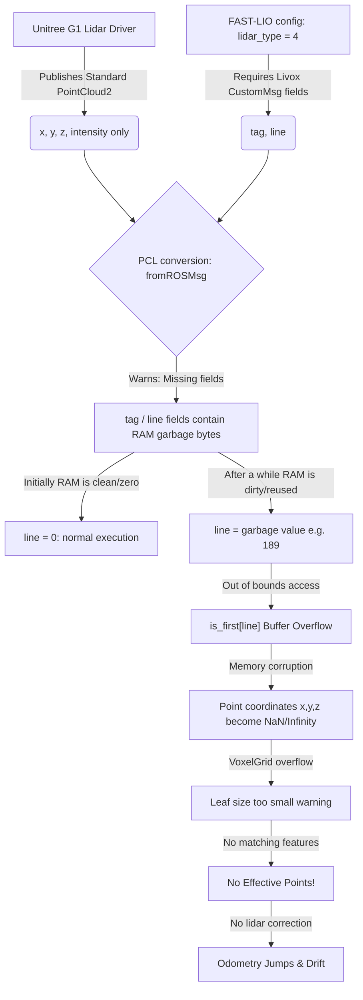

# Báo Cáo Tổng Hợp Lỗi Odometry FAST-LIO trên Unitree G1

## 1. Mô tả hiện tượng lỗi
Khi khởi chạy thuật toán định vị và xây dựng bản đồ **FAST-LIO** trên robot **Unitree G1** (sử dụng cảm biến **Livox Mid-360**), hệ thống gặp các lỗi sau:
1. **Ban đầu chạy bình thường**, nhưng sau một thời gian ngắn (khoảng vài phút) thì xuất hiện hàng loạt cảnh báo trong terminal chạy `fast_lio`:
   ```text
   [fastlio_mapping-1] Failed to find match for field 'tag'.
   [fastlio_mapping-1] Failed to find match for field 'line'.
   [fastlio_mapping-1] [pcl::VoxelGrid::applyFilter] Leaf size is too small for the input dataset. Integer indices would overflow.No Effective Points!
   [fastlio_mapping-1] No Effective Points!
   ```
2. **Odometry bị nhảy vọt (Jump)** cực kỳ lớn hoặc bị mất định vị hoàn toàn (đám mây điểm rây rác trên RViz bị trôi mất kiểm soát).

---

## 2. Nguyên nhân cốt lõi (Root Cause)

Lỗi bắt nguồn từ sự không tương thích giữa định dạng dữ liệu đầu ra của driver LiDAR robot và kiểu LiDAR được khai báo trong file cấu hình FAST-LIO (`mid360.yaml`), dẫn đến **lỗi tràn bộ nhớ (Buffer Overflow)** sau một thời gian chạy:



### Chi tiết kỹ thuật:
1. **Sự thiếu hụt trường dữ liệu:**
   Đầu vào từ topic `/utlidar/cloud_livox_mid360_sync` là Point Cloud chuẩn (`sensor_msgs/msg/PointCloud2`), chỉ có 4 trường là `x`, `y`, `z` và `intensity`. Nó hoàn toàn **không** chứa hai trường tùy chỉnh của Livox là `tag` và `line`.
2. **Hành vi chuyển đổi kiểu dữ liệu:**
   Khi cấu hình `lidar_type: 4` (MID360), FAST-LIO sử dụng bộ xử lý `mid360_handler` để chuyển đổi Point Cloud nhận được sang kiểu dữ liệu `LivoxPointXyzitl` (kiểu có `tag` và `line`). Vì bản tin đầu vào không có hai trường này, hàm `pcl::fromROSMsg` không ghi đè dữ liệu vào các ô nhớ tương ứng của `tag` và `line` trên struct.
3. **Tại sao lỗi xảy ra sau một thời gian chạy?**
   * **Giai đoạn đầu:** Khi chương trình mới khởi động, hệ điều hành cấp phát các trang nhớ RAM mới (mặc định đã được xóa về `0`). Trường `line` nhận giá trị mặc định là `0` (nằm trong khoảng quét hợp lệ `[0, 3]` của Mid-360). Thuật toán chạy bình thường.
   * **Giai đoạn sau:** Khi chương trình chạy liên tục, RAM được giải phóng và cấp phát lại (`reused memory`). Các ô nhớ mới này chứa các byte rác (`garbage bytes`) của các tiến trình/tính toán cũ. Lúc này, trường `line` nhận một giá trị ngẫu nhiên rất lớn (ví dụ: `189`).
4. **Hậu quả tràn mảng:**
   Hàm xử lý truy cập mảng trạng thái quét với chỉ số `line` rác:
   ```cpp
   int layer = pl_orig.points[i].line; // layer = 189 (rác)
   if (is_first[layer]) { ... } // Mảng is_first chỉ có kích thước là 4 (N_SCANS)
   ```
   Việc này ghi đè các giá trị rác vào các vùng nhớ xung quanh (trong đó có tọa độ điểm `x, y, z` của `added_pt`), làm hỏng toàn bộ đám mây điểm (biến thành các giá trị cực lớn hoặc `NaN`).
5. **Hủy hoại thuật toán Odometry:**
   * Bộ lọc Voxel Grid không thể xử lý các điểm lỗi này, báo lỗi `Integer indices would overflow` và loại bỏ toàn bộ điểm hiệu dụng về `0` (`No Effective Points!`).
   * Không có dữ liệu LiDAR để sửa sai số cho IMU, bộ lọc Kalman (IEKF) chỉ ước lượng vị trí dựa trên tích phân IMU dẫn đến trôi vị trí rất nhanh.
   * Khi thỉnh thoảng có khung quét hợp lệ trở lại, khoảng cách hiệu chỉnh quá lớn khiến vị trí robot bị giật/nhảy vọt một khoảng lớn trên RViz.

---

## 3. Cách giải quyết triệt để

### Bước 1: Điều chỉnh tệp cấu hình (`mid360.yaml`)
Chuyển cấu hình `lidar_type` từ `4` sang `5` (định dạng `generic PointXYZI` chuẩn) để tắt chế độ tìm kiếm các trường Livox tùy chỉnh (`tag`, `line`), tránh lỗi rác bộ nhớ:

* **Tệp tin sửa đổi:** `/home/hoangdc/ROS2/unitree_G1/dev_unitreeg1_ws/src/FAST_LIO_ROS2/config/mid360.yaml`
```diff
     preprocess:
-      lidar_type: 4 # 1 for Livox serials LiDAR, 2 for Velodyne LiDAR, 3 for ouster LiDAR, 4 for MID360, 5 for generic PointXYZI
+      lidar_type: 5 # 1 for Livox serials LiDAR, 2 for Velodyne LiDAR, 3 for ouster LiDAR, 4 for MID360, 5 for generic PointXYZI
       scan_line: 4
```

### Bước 2: Build lại Package
Vì ROS 2 đọc file cấu hình từ thư mục `install/`, cần build lại package `fast_lio` bằng lệnh:
```bash
colcon build --packages-select fast_lio
```

### Bước 3: Kết quả thực tế
Sau khi chuyển sang kiểu `5`, FAST-LIO sử dụng `default_handler` để phân tích Point Cloud một cách an toàn. Các lỗi cảnh báo trong terminal biến mất hoàn toàn, Odometry hoạt động mượt mà, chính xác và không còn hiện tượng nhảy vọt tọa độ.
