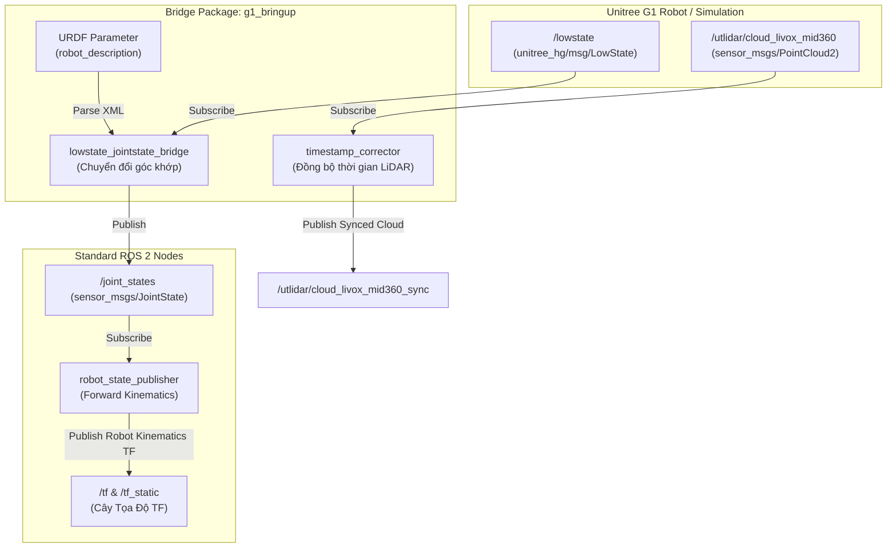

# Hướng Dẫn Thiết Kế Package `g1_bringup` Khôi Phục TF Robot Unitree G1

Tài liệu này hướng dẫn chi tiết cách thiết lập package ROS 2 chuyên dụng để khôi phục hệ thống TF (Transform Tree) của robot humanoid Unitree G1. Hệ thống hỗ trợ hai chế độ hoạt động: chế độ kết hợp **Bộ ước lượng trạng thái EKF** (State Estimator) và chế độ **Chỉ chạy LIO** (LIO-only).

---

## 1. Thiết Kế Kiến Trúc & Luồng Dữ Liệu ROS 2

Kiến trúc bringup được thiết kế linh hoạt, cho phép chuyển đổi cấu hình TF tùy thuộc vào việc bạn chạy định vị bằng EKF tích hợp (động học chân + IMU + LIO) hay chỉ chạy FAST-LIO.

### 1.1 Sơ đồ khối tổng quan hệ thống bringup



---

## 2. Cấu Trúc Thư Mục Package

Package `g1_bringup` được viết dưới dạng **Python Ament Package** trong workspace `src/g1_bringup`.

```text
src/g1_bringup/
├── config/
│   └── g1_bringup.yaml                # File cấu hình các transform tĩnh và chế độ chạy
├── g1_bringup/
│   ├── __init__.py
│   ├── lowstate_jointstate_bridge.py  # Chuyển đổi dữ liệu /lowstate sang /joint_states chuẩn
│   └── timestamp_corrector.py         # Đồng bộ timestamp của LiDAR theo giờ máy tính (Host time)
├── launch/
│   └── g1_bringup.launch.py           # Launch file khởi tạo toàn bộ các node bringup và static TF
├── package.xml                        # Khai báo dependencies (rclpy, sensor_msgs, unitree_hg, tf2_ros)
├── setup.cfg                          # Cấu hình cài đặt script chạy
├── setup.py                           # Đăng ký các node thực thi và file cấu hình
└── README.md                          # Tài liệu hướng dẫn
```

---

## 3. Chi Tiết Các Thành Phần Cấu Hình & Mã Nguồn

### 3.1. Node Chuyển Đổi Khớp `lowstate_jointstate_bridge.py`
* **Vai trò:** Đọc và phân tích file URDF của G1 từ parameter `/robot_description`, đăng ký nhận `/lowstate` từ robot, sau đó xuất bản thông tin góc khớp chuẩn hóa sang topic `/joint_states` (`sensor_msgs/msg/JointState`).
* **Tính năng:** Tự động sửa lỗi lệch mốc thời gian bằng cách đồng bộ thời gian của thông điệp khớp theo thời gian thực của máy tính chạy ROS 2 (`self.get_clock().now()`).

### 3.2. Node Đồng Bộ Thời Gian LiDAR `timestamp_corrector.py`
* **Vai trò:** Sửa lỗi lệch mốc thời gian phần cứng của LiDAR Livox Mid-360.
* **Nguyên lý hoạt động:** Nhận dữ liệu pointcloud thô từ `/utlidar/cloud_livox_mid360` (sử dụng mốc thời gian phần cứng bắt đầu từ `0.0`), hiệu chỉnh lại `header.stamp` khớp với thời gian thực tế của máy tính chủ (Host PC), rồi xuất bản ra topic `/utlidar/cloud_livox_mid360_sync`. Từ đó giúp FAST-LIO không bị drop message.

### 3.3. File Cấu Hì̀nh `g1_bringup.yaml`
Quản lý tập trung toàn bộ cấu hình hoạt động của robot:
* **`developer_mode`**: Đặt thành `true` để khởi động robot state publisher và node bridge khớp.
* **`model`**: Lựa chọn phiên bản robot `23dof` hoặc `29dof`.
* **`sync_lidar_time`**: Bật/tắt việc chạy node `timestamp_corrector` để đồng bộ thời gian LiDAR.
* **`use_state_estimator`**: Lựa chọn chế độ chuyển đổi TF (EKF vs LIO-only).
* **`static_transforms`**: Định nghĩa thông số hình học (X, Y, Z, R, P, Y) cho tất cả liên kết tĩnh trong hệ thống (`base_link` -> `pelvis`, `mid360_link` -> `livox_frame`, `pelvis` -> `dog_imu_link`, v.v.).

---

## 4. Cơ Chế Quản Lý Cây Tọa Độ (TF Tree Modes)

Tùy thuộc vào cấu hình tham số `use_state_estimator` trong file `g1_bringup.yaml`, cây tọa độ TF sẽ được cấu hình theo 2 sơ đồ dưới đây để tránh xung đột vòng lặp (loop TF):

### Chế độ A: Sử dụng Bộ ước lượng trạng thái EKF (`use_state_estimator: true`)
Dùng khi bạn muốn kết hợp động học chân, IMU và FAST-LIO qua bộ lọc EKF để triệt tiêu lỗi trôi trục Z.
* **Bộ bringup tạo liên kết tĩnh:**
  * `base_link` ──► `body`
  * `camera_init` ──► `odom`
* **Bộ ước lượng EKF (`g1_state_estimator`) xuất bản:**
  * `odom` ──► `base_link` (Dynamic TF)
* **Luồng TF đầy đủ:**
  ```text
  [camera_init] ──(Tĩnh)──► [odom] ──(Động EKF)──► [base_link] ──(Tĩnh)──► [body]
  ```
  *(Chú ý: Trong chế độ này, FAST-LIO chạy tự do trong hệ tọa độ `camera_init` -> `body` mà không phát hành transform `odom -> base_link` để tránh xung đột).*

### Chế độ B: Chỉ chạy LIO (`use_state_estimator: false`)
Dùng khi chạy độc lập thuật toán FAST-LIO mà không qua bộ ước lượng EKF.
* **Bộ bringup tạo liên kết tĩnh:**
  * `body` ──► `base_link`
  * `odom` ──► `odom_livox`
  * `odom_livox` ──► `camera_init`
* **FAST-LIO (`laser_mapping`) xuất bản:**
  * `camera_init` ──► `body` (Dynamic TF)
* **Luồng TF đầy đủ:**
  ```text
  [odom] ──(Tĩnh)──► [odom_livox] ──(Tĩnh)──► [camera_init] ──(Động LIO)──► [body] ──(Tĩnh)──► [base_link]
  ```

---

## 5. Hướng Dẫn Biên Dịch & Vận Hành

### Bước 1: Biên dịch không gian làm việc
```bash
cd /home/hoangdc/ROS2/unitree_G1/dev_unitreeg1_ws
colcon build --packages-select g1_bringup
source install/setup.bash
```

### Bước 2: Khởi chạy Bringup
Chạy file launch để đưa hệ thống TF cơ bản của robot lên:
```bash
ros2 launch g1_bringup g1_bringup.launch.py
```
*Lưu ý: Bạn có thể override trực tiếp cấu hình qua command line nếu cần:*
* Chuyển đổi model robot: `model:=23dof`
* Tắt đồng bộ thời gian LiDAR: `sync_lidar_time:=false`
* Tắt chế độ tương thích EKF: `use_state_estimator:=false`

### Bước 3: Kiểm tra chẩn đoán hệ thống TF
1. **Kiểm tra đồ thị TF (TF Tree):**
   ```bash
   ros2 run tf2_tools view_frames
   ```
   Mở file `frames.pdf` được sinh ra để kiểm tra xem cây tọa độ có bị đứt gãy hay xuất hiện vòng lặp (loop) nào không.
2. **Kiểm tra độ trễ và tần số phát TF:**
   ```bash
   ros2 run tf2_ros tf_monitor
   ```
3. **Xem trực quan cấu trúc robot:**
   ```bash
   rviz2
   ```
   Chọn **Fixed Frame** là `base_link` và thêm module **RobotModel**, **TF** để kiểm tra chuyển động các khớp cơ học của robot G1.
