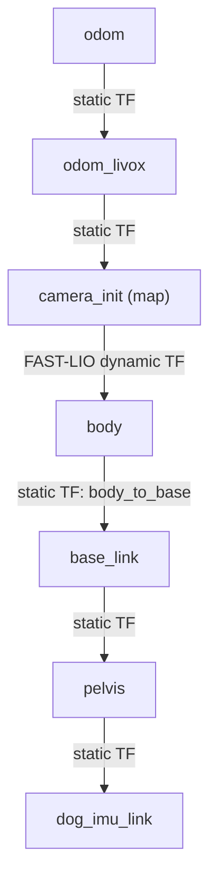
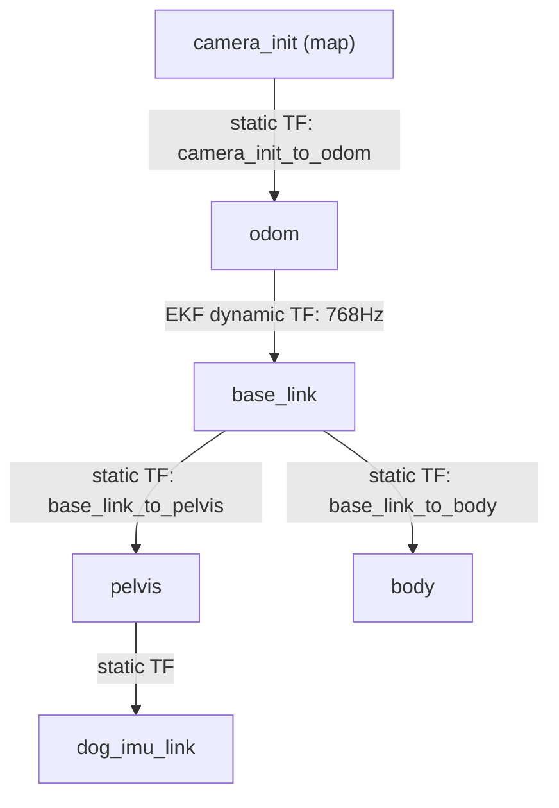

# Hướng dẫn Cấu hình TF và Chuyển đổi Chế độ (EKF vs LIO-only)

Tài liệu này ghi lại chi tiết các thay đổi cấu hình hệ tọa độ (TF Tree) trên robot Unitree G1, so sánh trước và sau khi tối ưu hóa, cùng với hướng dẫn cách cấu hình chuyển đổi linh hoạt giữa chế độ **State Estimator (EKF)** và chế độ **FAST-LIO độc lập (LIO-only)**.

---

## 1. So sánh Cây TF Trước và Sau Chỉnh Sửa

### Cây TF Trước Chỉnh Sửa (LIO-only Mode)

Trong cấu hình mặc định ban đầu, FAST-LIO làm chủ cây TF. Cảm biến LiDAR (`body`) đóng vai trò là frame cha của thân robot (`base_link`), đây là cấu hình tạm thời (hack) để hiển thị mô hình robot trên RViz khi chưa có bộ lọc EKF.



* **Hạn chế**:
  1. **Sai lệch vật lý**: Cảm biến LiDAR thực tế được gắn cứng trên robot, do đó `body` phải là con của `base_link`, không phải cha.
  2. **Xung đột TF**: Nếu chạy State Estimator để phát TF `odom` $\rightarrow$ `base_link`, cây TF sẽ bị lặp (loop) và xung đột nghiêm trọng do `base_link` có 2 cha (`body` và `odom`), dẫn đến mô hình robot bị giật lắc liên tục trên RViz.

---

### Cây TF Sau Chỉnh Sửa (EKF Mode - Chuẩn REP-105)

Trong cấu hình mới chuẩn hóa, bộ ước lượng trạng thái EKF làm chủ chuyển động của robot. LiDAR (`body`) được đưa về đúng vị trí là con của `base_link`. FAST-LIO tắt tính năng phát TF và chỉ đẩy dữ liệu đo dạng topic `/Odometry` cho EKF.



* **Ưu điểm**:
  1. **Đúng bản chất vật lý**: Cảm biến LiDAR là con của thân robot.
  2. **Không xung đột TF**: Cây TF là dạng cây đơn (acyclic), sạch sẽ và tuân thủ tiêu chuẩn ROS REP-105.
  3. **Mượt mà và thời gian thực**: Toàn bộ robot di chuyển trên RViz theo EKF tần số cao (768Hz), không có độ trễ của LiDAR.

---

## 2. Các Tệp Tin Đã Được Chỉnh Sửa

Hệ thống đã được thiết kế lại theo dạng **tham số hóa (parameters-driven)** để bạn có thể chuyển đổi chế độ dễ dàng thông qua các tệp cấu hình yaml:

### A. Gói `g1_bringup` (Chạy các static TF và Robot State)

* **Tệp `g1_bringup.yaml`**:
  * Thêm tham số: `use_state_estimator: true` (hoặc `false`).
  * Khai báo thêm 2 static TF mới:
    * `base_link_to_body`: Phép biến đổi ngược của `body_to_base` để gắn LiDAR làm con của robot.
    * `camera_init_to_odom`: Liên kết hệ tọa độ bản đồ với hệ odom của bộ lọc.
* **Tệp `g1_bringup.launch.py`**:
  * Đọc tham số `use_state_estimator`.
  * Nếu là `true` (Chế độ EKF): Tự động chỉ chạy các static TF đảo chiều (`base_link_to_body`, `camera_init_to_odom`), ngắt các TF cũ.
  * Nếu là `false` (LIO-only): Chạy các static TF cũ giống như ban đầu.

### B. Gói `FAST_LIO_ROS2` (Thuật toán LiDAR SLAM)

* **Tệp `laserMapping.cpp`**:
  * Thêm biến toàn cục và tham số `publish.tf_en` (mặc định `true`).
  * Chỉ phát TF động `camera_init` $\rightarrow$ `body` nếu `tf_en` được cấu hình là `true`.
* **Tệp `mid360.yaml`**:
  * Cấu hình thêm: `tf_en: false` dưới mục `publish` để tắt phát TF khi chạy cùng EKF.

### C. Gói `g1_state_estimator` (Bộ lọc EKF)

* **Tệp `estimator_node.cpp` & `estimator_node.h`**:
  * Thêm tham số `publish_tf` (mặc định `true`).
  * Chỉ phát TF động `odom` $\rightarrow$ `base_link` nếu `publish_tf` được cấu hình là `true`.
* **Tệp `estimator.yaml`**:
  * Đặt `base_frame: "base_link"` và `publish_tf: true`.

---

## 3. Hướng dẫn Chuyển đổi Chế độ nhanh

### Cách 1: Chạy chế độ State Estimator (EKF - Khuyên dùng)

Chế độ này kết hợp chân + IMU + FAST-LIO qua bộ lọc EKF, hiển thị robot mượt mà tần số cao.

1. Mở `/home/hoangdc/ROS2/unitree_G1/dev_unitreeg1_ws/src/g1_bringup/config/g1_bringup.yaml`:
   ```yaml
   use_state_estimator: true
   ```
2. Mở `/home/hoangdc/ROS2/unitree_G1/dev_unitreeg1_ws/src/FAST_LIO_ROS2/config/mid360.yaml`:
   ```yaml
   publish:
     tf_en: false  # Tắt phát TF từ FAST-LIO
   ```
3. Mở `/home/hoangdc/ROS2/unitree_G1/dev_unitreeg1_ws/src/g1_state_estimator/config/estimator.yaml`:
   ```yaml
   publish_tf: true  # Cho phép EKF phát TF
   ```

### Cách 2: Chạy chế độ FAST-LIO độc lập (LIO-only)

Phục vụ khi bạn không muốn chạy node EKF mà chỉ muốn chạy FAST-LIO độc lập giống như ban đầu.

1. Mở `/home/hoangdc/ROS2/unitree_G1/dev_unitreeg1_ws/src/g1_bringup/config/g1_bringup.yaml`:
   ```yaml
   use_state_estimator: false
   ```
2. Mở `/home/hoangdc/ROS2/unitree_G1/dev_unitreeg1_ws/src/FAST_LIO_ROS2/config/mid360.yaml`:
   ```yaml
   publish:
     tf_en: true   # Bật lại phát TF từ FAST-LIO
   ```
3. Mở `/home/hoangdc/ROS2/unitree_G1/dev_unitreeg1_ws/src/g1_state_estimator/config/estimator.yaml`:
   ```yaml
   publish_tf: false # Tắt phát TF từ EKF
   ```
