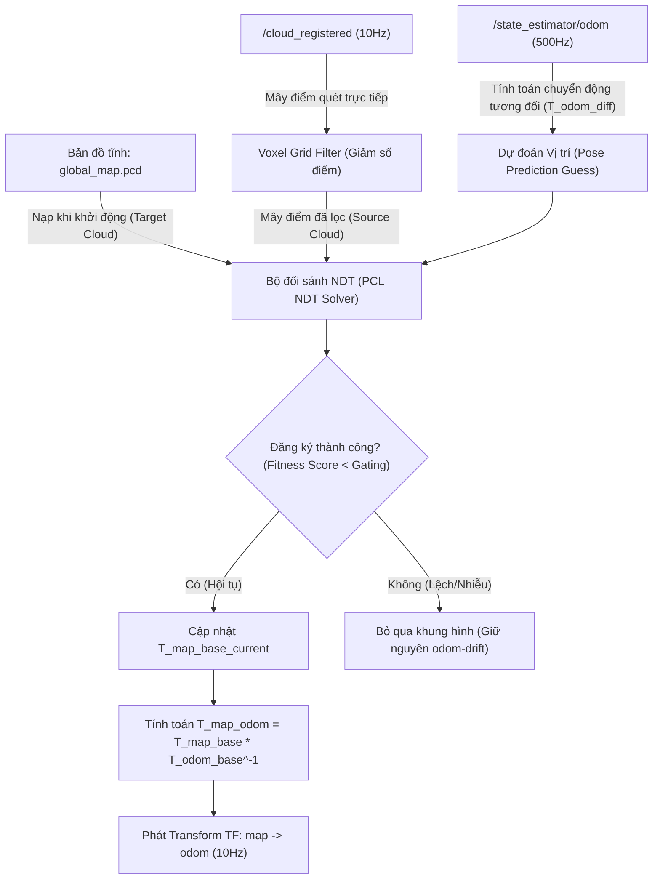

# Kế hoạch Triển khai Chi tiết: NDT Localization Node độc lập cho Unitree G1 (Package g1_localization)

Tài liệu này trình bày chi tiết kiến trúc phần mềm, thuật toán, mã nguồn C++ mẫu và cấu hình hoàn chỉnh để triển khai **gói định vị 3D sử dụng thuật toán NDT (Normal Distributions Transform)** độc lập trong bản đồ PCD tĩnh cho robot Unitree G1.

---

## 1. Kiến trúc Hệ thống & Luồng Dữ liệu (System Architecture)

Node `ndt_localization_node` (nằm trong package mới `g1_localization`) sẽ hoạt động như một thành phần độc lập trong luồng xử lý định vị toàn cục. Nó liên kết chặt chẽ với EKF cục bộ (`g1_state_estimator_node`) để giữ cho robot di chuyển mượt mà không bị trôi hay giật giật TF.



### Các Frame tọa độ chính:

* `map`: Khung tọa độ gốc cố định của thế giới (0,0,0 nằm ở vị trí khởi tạo bản đồ tĩnh).
* `odom`: Khung tọa độ cục bộ của EKF (liên tục, không giật nhảy nhưng bị trôi tích lũy theo thời gian).
* `base_link`: Khung tọa độ đặt tại xương chậu (pelvis) của robot G1.

---

## 2. Nguyên lý Tính đoán Pose Guess bằng Odometry (Pose Prediction)

Để NDT hội tụ nhanh (trong vòng 5-10ms) và tránh bị rơi vào cực tiểu cục bộ (local minima), chúng ta cần cung cấp một vị trí dự đoán ban đầu (`T_map_base_guess`) cực kỳ sát với thực tế cho mỗi khung quét LiDAR.

Gọi $t_{k-1}$ là thời điểm xử lý khung quét trước, và $t_k$ là thời điểm hiện tại.

1. Từ EKF Odometry, ta có tư thế tại hai thời điểm: $T_{odom\_base}(t_{k-1})$ và $T_{odom\_base}(t_k)$.
2. Dịch chuyển tương đối của robot trong hệ odom giữa hai khung hình là:
   $$
   \Delta T_{odom} = T_{odom\_base}(t_{k-1})^{-1} \cdot T_{odom\_base}(t_k)
   $$
3. Vị trí dự đoán đoán trong hệ bản đồ toàn cục tại thời điểm $t_k$ sẽ là:
   $$
   T_{map\_base\_guess}(t_k) = T_{map\_base\_current}(t_{k-1}) \cdot \Delta T_{odom}
   $$
4. Ta nạp $T_{map\_base\_guess}(t_k)$ làm giá trị đoán ban đầu cho hàm `ndt.align()`.

---

## 3. Bản vẽ Chi tiết Mã nguồn C++ (`ndt_localization_node.cpp`)

Dưới đây là mã nguồn hoàn chỉnh dự kiến cho Node Định vị. Node này được thiết kế tối ưu hóa bộ nhớ, an toàn đa luồng (thread-safe) và xử lý ngoại lệ tốt.

### 3.1. Header File: `ndt_localization_node.hpp`

Đặt tại: `g1_localization/include/g1_localization/ndt_localization_node.hpp`

```cpp
#pragma once
#include <rclcpp/rclcpp.hpp>
#include <sensor_msgs/msg/point_cloud2.hpp>
#include <nav_msgs/msg/odometry.hpp>
#include <geometry_msgs/msg/pose_with_covariance_stamped.hpp>
#include <geometry_msgs/msg/pose_stamped.hpp>
#include <tf2_ros/transform_broadcaster.h>
#include <tf2_ros/buffer.h>
#include <tf2_ros/transform_listener.h>
#include <tf2_eigen/tf2_eigen.hpp>

#include <pcl/point_cloud.h>
#include <pcl/point_types.h>
#include <pcl/registration/ndt.h>
#include <pcl/filters/voxel_grid.h>
#include <pcl_conversions/pcl_conversions.h>

#include <mutex>
#include <deque>

class NdtLocalizationNode : public rclcpp::Node {
public:
    using PointT = pcl::PointXYZI;
    NdtLocalizationNode();
    ~NdtLocalizationNode() = default;

private:
    void loadStaticMap();
    void odomCallback(const nav_msgs::msg::Odometry::SharedPtr msg);
    void initialPoseCallback(const geometry_msgs::msg::PoseWithCovarianceStamped::SharedPtr msg);
    void cloudCallback(const sensor_msgs::msg::PointCloud2::SharedPtr msg);
  
    bool getRelativeOdom(double t_prev, double t_curr, Eigen::Affine3d& delta_odom);
    void updateMapOdomTransform(const Eigen::Affine3d& T_map_base);
    void publishTFAndPose(const rclcpp::Time& stamp);

    // ROS 2 Interfaces
    rclcpp::Subscription<sensor_msgs::msg::PointCloud2>::SharedPtr cloud_sub_;
    rclcpp::Subscription<geometry_msgs::msg::PoseWithCovarianceStamped>::SharedPtr initial_pose_sub_;
    rclcpp::Subscription<nav_msgs::msg::Odometry>::SharedPtr odom_sub_;
  
    rclcpp::Publisher<sensor_msgs::msg::PointCloud2>::SharedPtr map_pub_;
    rclcpp::Publisher<geometry_msgs::msg::PoseStamped>::SharedPtr pose_pub_;

    std::unique_ptr<tf2_ros::TransformBroadcaster> tf_broadcaster_;
    std::shared_ptr<tf2_ros::Buffer> tf_buffer_;
    std::shared_ptr<tf2_ros::TransformListener> tf_listener_;

    // Parameters
    std::string map_pcd_path_;
    std::string map_frame_;
    std::string odom_frame_;
    std::string base_frame_;
  
    double ndt_resolution_;
    double ndt_step_size_;
    double ndt_epsilon_;
    int ndt_max_iterations_;
    double live_voxel_size_;
    double max_fitness_score_;
  
    // Core Maps & Algorithms
    pcl::PointCloud<PointT>::Ptr static_map_;
    pcl::NormalDistributionsTransform<PointT, PointT> ndt_;
    pcl::VoxelGrid<PointT> voxel_filter_;

    // States
    std::mutex state_mutex_;
    Eigen::Affine3d T_map_base_current_ = Eigen::Affine3d::Identity();
    Eigen::Affine3d T_map_odom_ = Eigen::Affine3d::Identity();
    double last_cloud_time_ = 0.0;
    bool is_initialized_ = false;

    // Odometry Buffer
    std::mutex odom_mutex_;
    std::deque<nav_msgs::msg::Odometry> odom_buffer_;
    bool has_odom_ = false;
};
```

### 3.2. Source File: `ndt_localization_node.cpp`

Đặt tại: `g1_localization/src/ndt_localization_node.cpp`

```cpp
#include "g1_localization/ndt_localization_node.hpp"
#include <pcl/io/pcd_io.h>

NdtLocalizationNode::NdtLocalizationNode() : Node("ndt_localization_node") {
    // 1. Declare and Load Parameters
    map_pcd_path_ = this->declare_parameter<std::string>("map_pcd_path", "");
    map_frame_ = this->declare_parameter<std::string>("map_frame", "map");
    odom_frame_ = this->declare_parameter<std::string>("odom_frame", "odom");
    base_frame_ = this->declare_parameter<std::string>("base_frame", "base_link");

    ndt_resolution_ = this->declare_parameter<double>("ndt_resolution", 1.0);
    ndt_step_size_ = this->declare_parameter<double>("ndt_step_size", 0.1);
    ndt_epsilon_ = this->declare_parameter<double>("ndt_epsilon", 1e-6);
    ndt_max_iterations_ = this->declare_parameter<int>("ndt_max_iterations", 35);
    live_voxel_size_ = this->declare_parameter<double>("live_voxel_size", 0.3);
    max_fitness_score_ = this->declare_parameter<double>("max_fitness_score", 0.5);

    // 2. Load Static Map
    loadStaticMap();

    // 3. Configure NDT Solver
    ndt_.setTransformationEpsilon(ndt_epsilon_);
    ndt_.setStepSize(ndt_step_size_);
    ndt_.setResolution(ndt_resolution_);
    ndt_.setMaximumIterations(ndt_max_iterations_);
    ndt_.setInputTarget(static_map_);

    // 4. Configure Voxel Filter
    voxel_filter_.setLeafSize(live_voxel_size_, live_voxel_size_, live_voxel_size_);

    // 5. Setup Interfaces
    cloud_sub_ = this->create_subscription<sensor_msgs::msg::PointCloud2>(
        "/cloud_registered", 5, std::bind(&NdtLocalizationNode::cloudCallback, this, std::placeholders::_1));
  
    initial_pose_sub_ = this->create_subscription<geometry_msgs::msg::PoseWithCovarianceStamped>(
        "/initialpose", 10, std::bind(&NdtLocalizationNode::initialPoseCallback, this, std::placeholders::_1));
    
    odom_sub_ = this->create_subscription<nav_msgs::msg::Odometry>(
        "/state_estimator/odom", 10, std::bind(&NdtLocalizationNode::odomCallback, this, std::placeholders::_1));

    map_pub_ = this->create_publisher<sensor_msgs::msg::PointCloud2>("/state_estimator/localization_map", 1);
    pose_pub_ = this->create_publisher<geometry_msgs::msg::PoseStamped>("/state_estimator/localized_pose", 10);

    tf_broadcaster_ = std::make_unique<tf2_ros::TransformBroadcaster>(*this);
    tf_buffer_ = std::make_shared<tf2_ros::Buffer>(this->get_clock());
    tf_listener_ = std::make_shared<tf2_ros::TransformListener>(*tf_buffer_);

    // Publish static map once
    sensor_msgs::msg::PointCloud2 map_msg;
    pcl::toROSMsg(*static_map_, map_msg);
    map_msg.header.frame_id = map_frame_;
    map_msg.header.stamp = this->get_clock()->now();
    map_pub_->publish(map_msg);

    RCLCPP_INFO(this->get_logger(), "NDT 3D Localization Node fully initialized.");
}

void NdtLocalizationNode::loadStaticMap() {
    static_map_.reset(new pcl::PointCloud<PointT>());
    if (map_pcd_path_.empty()) {
        RCLCPP_ERROR(this->get_logger(), "Parameter 'map_pcd_path' is empty! Cannot run localization.");
        return;
    }
    if (pcl::io::loadPCDFile<PointT>(map_pcd_path_, *static_map_) == -1) {
        RCLCPP_ERROR(this->get_logger(), "Failed to read PCD map from: %s", map_pcd_path_.c_str());
        return;
    }
    RCLCPP_INFO(this->get_logger(), "Static map loaded successfully with %lu points.", static_map_->size());
}

void NdtLocalizationNode::odomCallback(const nav_msgs::msg::Odometry::SharedPtr msg) {
    std::lock_guard<std::mutex> lock(odom_mutex_);
    odom_buffer_.push_back(*msg);
    if (odom_buffer_.size() > 2000) {
        odom_buffer_.pop_front();
    }
    has_odom_ = true;
}

void NdtLocalizationNode::initialPoseCallback(const geometry_msgs::msg::PoseWithCovarianceStamped::SharedPtr msg) {
    std::lock_guard<std::mutex> lock(state_mutex_);
    T_map_base_current_.translation() = Eigen::Vector3d(
        msg->pose.pose.position.x, msg->pose.pose.position.y, msg->pose.pose.position.z);
  
    T_map_base_current_.linear() = Eigen::Quaterniond(
        msg->pose.pose.orientation.w, msg->pose.pose.orientation.x,
        msg->pose.pose.orientation.y, msg->pose.pose.orientation.z).toRotationMatrix();

    is_initialized_ = true;
    last_cloud_time_ = 0.0;
    RCLCPP_INFO(this->get_logger(), "Manual initial pose set from RViz: [%.2f, %.2f, %.2f]",
                T_map_base_current_.translation().x(),
                T_map_base_current_.translation().y(),
                T_map_base_current_.translation().z());
}

bool NdtLocalizationNode::getRelativeOdom(double t_prev, double t_curr, Eigen::Affine3d& delta_odom) {
    std::lock_guard<std::mutex> lock(odom_mutex_);
    if (odom_buffer_.size() < 2) return false;

    // Find closest odoms in time
    int idx_prev = -1, idx_curr = -1;
    double min_dt_prev = 1e9, min_dt_curr = 1e9;

    for (size_t i = 0; i < odom_buffer_.size(); ++i) {
        double t_odom = rclcpp::Time(odom_buffer_[i].header.stamp).seconds();
        double dt_prev = std::abs(t_odom - t_prev);
        double dt_curr = std::abs(t_odom - t_curr);

        if (dt_prev < min_dt_prev) { min_dt_prev = dt_prev; idx_prev = i; }
        if (dt_curr < min_dt_curr) { min_dt_curr = dt_curr; idx_curr = i; }
    }

    if (idx_prev != -1 && idx_curr != -1 && min_dt_prev < 0.1 && min_dt_curr < 0.1) {
        Eigen::Affine3d T_odom_prev, T_odom_curr;
        tf2::fromMsg(odom_buffer_[idx_prev].pose.pose, T_odom_prev);
        tf2::fromMsg(odom_buffer_[idx_curr].pose.pose, T_odom_curr);
    
        delta_odom = T_odom_prev.inverse() * T_odom_curr;
        return true;
    }
    return false;
}

void NdtLocalizationNode::cloudCallback(const sensor_msgs::msg::PointCloud2::SharedPtr msg) {
    if (!is_initialized_) {
        RCLCPP_WARN_THROTTLE(this->get_logger(), *this->get_clock(), 5000,
                             "Localization is not initialized yet. Set 2D Pose Estimate on RViz.");
        return;
    }

    double current_cloud_time = rclcpp::Time(msg->header.stamp).seconds();

    // 1. Voxel filter input cloud to save CPU
    pcl::PointCloud<PointT>::Ptr raw_cloud(new pcl::PointCloud<PointT>());
    pcl::fromROSMsg(*msg, *raw_cloud);
  
    pcl::PointCloud<PointT>::Ptr filtered_cloud(new pcl::PointCloud<PointT>());
    voxel_filter_.setInputCloud(raw_cloud);
    voxel_filter_.filter(*filtered_cloud);

    // 2. Compute motion guess from Odometry
    Eigen::Affine3d T_map_base_guess = Eigen::Affine3d::Identity();
    {
        std::lock_guard<std::mutex> lock(state_mutex_);
        Eigen::Affine3d delta_odom;
        if (last_cloud_time_ > 0.0 && getRelativeOdom(last_cloud_time_, current_cloud_time, delta_odom)) {
            T_map_base_guess = T_map_base_current_ * delta_odom;
        } else {
            T_map_base_guess = T_map_base_current_;
        }
    }

    // 3. Align PointCloud using NDT
    ndt_.setInputSource(filtered_cloud);
    pcl::PointCloud<PointT> aligned_cloud;
  
    rclcpp::Time start_time = this->get_clock()->now();
    ndt_.align(aligned_cloud, T_map_base_guess.matrix().cast<float>());
    rclcpp::Time end_time = this->get_clock()->now();
    double solve_time_ms = (end_time - start_time).seconds() * 1000.0;

    if (ndt_.hasConverged()) {
        double score = ndt_.getFitnessScore();
        if (score < max_fitness_score_) {
            Eigen::Matrix4d T_ndt = ndt_.getFinalTransformation().cast<double>();
        
            std::lock_guard<std::mutex> lock(state_mutex_);
            T_map_base_current_.matrix() = T_ndt;
            last_cloud_time_ = current_cloud_time;
        
            updateMapOdomTransform(T_map_base_current_);
            publishTFAndPose(msg->header.stamp);
        
            RCLCPP_DEBUG(this->get_logger(), "NDT matched successfully (time: %.1fms, score: %.3f)", solve_time_ms, score);
        } else {
            RCLCPP_WARN(this->get_logger(), "NDT match rejected: fitness score too high (score: %.3f > limit: %.3f)", 
                        score, max_fitness_score_);
        }
    } else {
        RCLCPP_WARN(this->get_logger(), "NDT Solver failed to converge! Keeping last known pose.");
    }
}

void NdtLocalizationNode::updateMapOdomTransform(const Eigen::Affine3d& T_map_base) {
    std::lock_guard<std::mutex> lock_odom(odom_mutex_);
    if (odom_buffer_.empty()) return;

    // Get the latest EKF odometry pose
    Eigen::Affine3d T_odom_base;
    tf2::fromMsg(odom_buffer_.back().pose.pose, T_odom_base);

    // T_map_odom = T_map_base * T_odom_base^-1
    T_map_odom_ = T_map_base * T_odom_base.inverse();
}

void NdtLocalizationNode::publishTFAndPose(const rclcpp::Time& stamp) {
    // 1. Publish TF map -> odom
    geometry_msgs::msg::TransformStamped tf_msg;
    tf_msg.header.stamp = stamp;
    tf_msg.header.frame_id = map_frame_;
    tf_msg.child_frame_id = odom_frame_;

    tf_msg.transform = tf2::eigenToTransform(T_map_odom_).transform;
    tf_broadcaster_->sendTransform(tf_msg);

    // 2. Publish Localized Pose
    geometry_msgs::msg::PoseStamped pose_msg;
    pose_msg.header.stamp = stamp;
    pose_msg.header.frame_id = map_frame_;
    pose_msg.pose = tf2::toMsg(T_map_base_current_);
    pose_pub_->publish(pose_msg);
}

int main(int argc, char** argv) {
    rclcpp::init(argc, argv);
    auto node = std::make_shared<NdtLocalizationNode>();
    rclcpp::spin(node);
    rclcpp::shutdown();
    return 0;
}
```

---

## 4. File cấu hình tham số (`localization.yaml`)

File cấu hình này lưu trữ các tham số hoạt động của thuật toán NDT và đường dẫn bản đồ. Nó cần được đặt tại `src/g1_localization/config/localization.yaml`.

```yaml
ndt_localization_node:
  ros__parameters:
    # ----------------------------------------------------
    # Tọa độ và Khung tham chiếu
    # ----------------------------------------------------
    map_frame: "map"
    odom_frame: "odom"
    base_frame: "base_link"
    map_pcd_path: "/home/hoangdc/ROS2/unitree_G1/maps/g1_office.pcd" # Đường dẫn file bản đồ PCD đã lưu

    # ----------------------------------------------------
    # Cấu hình Thuật toán NDT (Tối ưu hóa tốc độ và độ chính xác)
    # ----------------------------------------------------
    ndt_resolution: 1.0                  # Kích thước ô voxel cho phân phối chuẩn NDT (1.0m là tiêu chuẩn cho LiDAR ngoài trời/trong nhà rộng)
    ndt_step_size: 0.1                   # Cự ly dịch chuyển lớn nhất mỗi lần lặp Newton (m) (giúp hội tụ mượt)
    ndt_epsilon: 0.000001                # Điều kiện dừng: sai số tối thiểu giữa các lần lặp
    ndt_max_iterations: 35               # Số lần lặp tối đa của Solver (đảm bảo khống chế thời gian xử lý)
  
    # ----------------------------------------------------
    # Tối ưu hóa dữ liệu & Bộ lọc
    # ----------------------------------------------------
    live_voxel_size: 0.3                 # Downsample PointCloud đầu vào bằng Voxel Grid (m) (giảm tải CPU từ ~20k điểm xuống ~2k điểm)
    max_fitness_score: 0.4               # Ngưỡng chấp nhận kết quả đối sánh (Gating). Nếu điểm số > 0.4 (sai số lớn), từ chối cập nhật TF.
```

---

## 5. Phác thảo Luồng chạy thực tế & Hướng dẫn từng bước (Step-by-step Execution Workflow)

Để triển khai và vận hành chế độ định vị (Pure Localization) độc lập một cách chuyên nghiệp, quy trình cần thực hiện theo các bước sau:

### Bước 1: Thu thập bản đồ toàn cục bằng chế độ SLAM

1. Chạy driver phần cứng robot:
   ```bash
   ros2 launch g1_bringup bringup.launch.py
   ```
2. Chạy luồng gộp SLAM:
   ```bash
   ros2 launch g1_state_estimator g1_mapping.launch.py
   ```
3. Di chuyển robot quanh khu vực cần vẽ bản đồ để GTSAM khép vòng lặp và tối ưu hóa bản đồ.
4. Gọi công cụ lưu toàn bộ bản đồ:
   ```bash
   ros2 run g1_state_estimator save_all_maps.py --dir /home/hoangdc/ROS2/unitree_G1/maps --prefix g1_office
   ```

   Lúc này, file `/home/hoangdc/ROS2/unitree_G1/maps/g1_office.pcd` sẽ được sử dụng làm bản đồ tĩnh để định vị.

### Bước 2: Tạo Package Định vị mới (`g1_localization`)

Ta sẽ tạo riêng một package ROS 2 mới độc lập nhằm mục đích module hóa và quản lý code localization tối ưu:

1. Di chuyển vào thư mục `src/` của workspace và tạo package:
   ```bash
   ros2 pkg create --build-type ament_cmake g1_localization --dependencies rclcpp sensor_msgs nav_msgs geometry_msgs tf2 tf2_ros tf2_eigen pcl_conversions
   ```
2. Tạo cấu trúc thư mục và file mã nguồn trong package mới:
   * Header đặt tại: `g1_localization/include/g1_localization/ndt_localization_node.hpp`
   * Source đặt tại: `g1_localization/src/ndt_localization_node.cpp`
   * Config đặt tại: `g1_localization/config/localization.yaml`
   * Launch đặt tại: `g1_localization/launch/g1_localization.launch.py`

### Bước 3: Khởi tạo vị trí ban đầu (Pose Initialization)

NDT là thuật toán khớp cục bộ (local registration), nên robot cần biết tọa độ xấp xỉ ban đầu để hội tụ đúng. Có 2 cách khởi tạo:

1. **Khởi tạo thủ công bằng RViz (Manual)**:
   * Trên giao diện RViz2, chọn công cụ **"2D Pose Estimate"**.
   * Click và kéo chuột trên bản đồ 3D chỉ hướng và vị trí tương đối của robot. Nút `ndt_localization_node` nhận tín hiệu qua topic `/initialpose`, cập nhật tọa độ xuất phát và bắt đầu quá trình tính toán.
2. **Khởi tạo tự động (Auto - Optional nâng cao)**:
   * Thiết lập tham số tọa độ ban đầu trực tiếp trong file cấu hình `localization.yaml` (ví dụ `initial_pose_x`, `initial_pose_y`, `initial_pose_z`, `initial_pose_yaw`). Node sẽ tự nạp các giá trị này làm điểm khởi đầu khi bật máy.

---

## 6. Cấu hình Chi tiết cho FAST-LIO2 ở Chế độ Định vị (Localization Mode)

Để FAST-LIO2 hoạt động như một bộ ước lượng odom cục bộ (local odometry front-end) mà không tranh giành transform toàn cục với NDT:

1. **TF configuration**:
   * Khi chạy SLAM, FAST-LIO2 thường publish TF từ `camera_init` $\rightarrow$ `body` hoặc `odom` $\rightarrow$ `base_link`.
   * Ở chế độ định vị, ta cấu hình FAST-LIO2 **chỉ publish vị trí odometry** lên topic `/state_estimator/odom` (hoặc `/fast_lio/odometry`), và để cho node EKF `g1_state_estimator` publish TF `odom` $\rightarrow$ `base_link`.
   * Node `ndt_localization_node` sẽ đảm nhiệm việc publish TF `map` $\rightarrow$ `odom`.
   * Cấu hình này giúp cây TF nhất quán hoàn toàn: `map` $\rightarrow$ `odom` $\rightarrow$ `base_link`.

---

## 7. Cấu trúc File Launch hợp nhất cho định vị (`g1_localization.launch.py`)

File launch này phối hợp khởi động:

1. FAST-LIO2 (ở chế độ local odometry).
2. EKF State Estimator (để giữ thăng bằng humanoid).
3. NDT Localization Node (nạp bản đồ tĩnh, hiệu chỉnh `map -> odom`).
4. Voxblox Local (chỉ chạy ESDF cục bộ để robot tránh vật cản thời gian thực mà không tốn CPU dựng lại lưới global).

```python
import os
import yaml
from ament_index_python.packages import get_package_share_directory
from launch import LaunchDescription
from launch.actions import DeclareLaunchArgument, IncludeLaunchDescription
from launch.launch_description_sources import PythonLaunchDescriptionSource
from launch.substitutions import LaunchConfiguration
from launch.conditions import IfCondition
from launch_ros.actions import Node

def generate_launch_description():
    pkg_localization = get_package_share_directory('g1_localization')
    pkg_estimator = get_package_share_directory('g1_state_estimator')
    pkg_fast_lio = get_package_share_directory('fast_lio')

    # 1. Khai báo các đối số Launch
    map_pcd_arg = DeclareLaunchArgument(
        'map_pcd_path',
        default_value='/home/hoangdc/ROS2/unitree_G1/maps/g1_office.pcd',
        description='Path to the static global PCD map'
    )
    run_voxblox_local_arg = DeclareLaunchArgument(
        'run_voxblox_local', default_value='true', # Bật ESDF local để tránh vật cản khi di chuyển
        description='Launch Voxblox Local Node for obstacle avoidance'
    )
    use_sim_time_arg = DeclareLaunchArgument(
        'use_sim_time', default_value='false',
        description='Use simulation clock if true'
    )

    # 2. Đường dẫn các file cấu hình
    config_estimator = os.path.join(pkg_estimator, 'config', 'estimator.yaml')
    config_localization = os.path.join(pkg_localization, 'config', 'localization.yaml')

    # Đọc cấu hình Voxblox Local từ g1_state_estimator
    local_config_path = os.path.join(pkg_estimator, 'config', 'voxblox_local.yaml')
    with open(local_config_path, 'r') as f:
        local_yaml = yaml.safe_load(f)
    local_key = list(local_yaml.keys())[0]
    local_params = local_yaml[local_key]['ros__parameters']

    # 3. FAST-LIO2 (Chạy chế độ local odom, không phát map TF)
    fast_lio_launch = IncludeLaunchDescription(
        PythonLaunchDescriptionSource(
            os.path.join(pkg_fast_lio, 'launch', 'mapping.launch.py')
        ),
        launch_arguments={
            'rviz': 'false',
            'use_sim_time': LaunchConfiguration('use_sim_time'),
            'config_file': 'mid360.yaml'
        }.items()
    )

    # 4. State Estimator Node (EKF 500Hz)
    estimator_node = Node(
        package='g1_state_estimator',
        executable='state_estimator_node',
        name='g1_state_estimator',
        output='screen',
        parameters=[config_estimator, {'use_sim_time': LaunchConfiguration('use_sim_time')}]
    )

    # 5. NDT Localization Node (Phát map -> odom)
    ndt_localization_node = Node(
        package='g1_localization',
        executable='ndt_localization_node',
        name='ndt_localization_node',
        output='screen',
        parameters=[
            config_localization,
            {
                'map_pcd_path': LaunchConfiguration('map_pcd_path'),
                'use_sim_time': LaunchConfiguration('use_sim_time')
            }
        ]
    )

    # 6. Voxblox Local Node (ESDF collision mapping - odom frame)
    voxblox_local_node = Node(
        package='voxblox_ros',
        executable='esdf_server',
        name='voxblox_local',
        output='screen',
        parameters=[local_params, {'use_sim_time': LaunchConfiguration('use_sim_time')}],
        remappings=[
            ('/voxblox_local/pointcloud', '/utlidar/cloud_livox_mid360_sync')
        ],
        condition=IfCondition(LaunchConfiguration('run_voxblox_local'))
    )

    # 7. RViz2 chuyên dụng cho Định vị
    rviz_node = Node(
        package='rviz2',
        executable='rviz2',
        name='rviz2',
        output='screen',
        arguments=['-d', os.path.join(pkg_localization, 'rviz', 'localization.rviz')]
    )

    return LaunchDescription([
        map_pcd_arg,
        run_voxblox_local_arg,
        use_sim_time_arg,
      
        fast_lio_launch,
        estimator_node,
        ndt_localization_node,
        voxblox_local_node,
        rviz_node
    ])
```

---

## 8. Hướng dẫn Đăng ký & Tích hợp vào Workspace

Khi tiến hành biên dịch:

1. **Cấu hình `CMakeLists.txt` của Package `g1_localization`**:
   ```cmake
   cmake_minimum_required(VERSION 3.8)
   project(g1_localization)

   if(NOT CMAKE_CXX_STANDARD)
     set(CMAKE_CXX_STANDARD 17)
   endif()

   if(CMAKE_COMPILER_IS_GNUCXX OR CMAKE_CXX_COMPILER_ID MATCHES "Clang")
     add_compile_options(-Wall -Wextra -Wpedantic -O3)
   endif()

   # Find dependencies
   find_package(ament_cmake REQUIRED)
   find_package(rclcpp REQUIRED)
   find_package(sensor_msgs REQUIRED)
   find_package(nav_msgs REQUIRED)
   find_package(geometry_msgs REQUIRED)
   find_package(tf2 REQUIRED)
   find_package(tf2_ros REQUIRED)
   find_package(tf2_eigen REQUIRED)
   find_package(pcl_conversions REQUIRED)

   # Find PCL
   find_package(PCL REQUIRED COMPONENTS common io registration filters)

   include_directories(
     include
     ${PCL_INCLUDE_DIRS}
   )

   # ROS 2 NDT Localization Node
   add_executable(ndt_localization_node
     src/ndt_localization_node.cpp
   )
   target_link_libraries(ndt_localization_node
     ${PCL_LIBRARIES}
   )
   ament_target_dependencies(ndt_localization_node
     rclcpp
     sensor_msgs
     nav_msgs
     geometry_msgs
     tf2
     tf2_ros
     tf2_eigen
     pcl_conversions
   )

   # Install targets
   install(TARGETS
     ndt_localization_node
     DESTINATION lib/${PROJECT_NAME}
   )

   install(DIRECTORY config launch rviz
     DESTINATION share/${PROJECT_NAME}
   )

   ament_package()
   ```

2. **Cấu hình `package.xml` của Package `g1_localization`**:
   ```xml
   <?xml version="1.0"?>
   <?xml-model href="http://download.ros.org/schema/package_format3.xsd" schematypens="http://www.w3.org/2001/XMLSchema"?>
   <package format="3">
     <name>g1_localization</name>
     <version>0.0.1</version>
     <description>NDT 3D Localization package for Unitree G1 robot</description>
     <maintainer email="hoangdc@todo.todo">hoangdc</maintainer>
     <license>MIT</license>

     <buildtool_depend>ament_cmake</buildtool_depend>

     <depend>rclcpp</depend>
     <depend>sensor_msgs</depend>
     <depend>nav_msgs</depend>
     <depend>geometry_msgs</depend>
     <depend>tf2</depend>
     <depend>tf2_ros</depend>
     <depend>tf2_eigen</depend>
     <depend>pcl_conversions</depend>
     <depend>libpcl-all-dev</depend>

     <test_depend>ament_lint_auto</test_depend>
     <test_depend>ament_lint_common</test_depend>

     <export>
       <build_type>ament_cmake</build_type>
     </export>
   </package>
   ```
