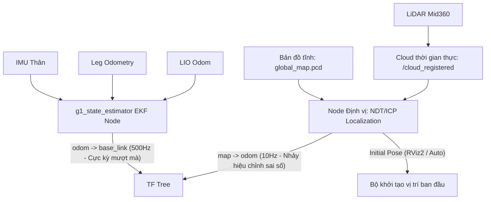

# Phân tích & Hướng dẫn Phát triển Hệ thống Định vị trong Bản đồ PCD 3D (3D Map Localization) cho Unitree G1

Tài liệu này phân tích chi tiết các phương án phát triển tính năng **Định vị trong bản đồ tĩnh đã có** (Pure Localization / Map-based Localization) cho robot Unitree G1, kế thừa trực tiếp từ hệ thống ước lượng trạng thái cục bộ mượt mà hiện tại (`g1_state_estimator` + `FAST_LIO_ROS2`).

---

## 1. Nguyên lý Thiết kế Hệ thống Định vị Rời rạc (Decoupled Localization)

Giống như khuyến nghị trong kiến trúc SLAM, đối với robot humanoid G1, việc thăng bằng (locomotion) luôn là ưu tiên tối cao. Do đó, hệ thống định vị toàn cục cũng phải được thiết kế rời rạc để tránh gây giật lag cho robot khi hiệu chỉnh sai số tọa độ toàn cục.

### Sơ đồ luồng dữ liệu và TF Tree trong chế độ Định vị



* **TF cục bộ (`odom -> base_link`)**: Do EKF (`g1_state_estimator`) đảm nhiệm xuất bản ở tần số 500Hz. Nhờ tích hợp Leg Odometry và IMU, transform này luôn liên tục, không bao giờ bị nhảy vọt ngay cả khi LiDAR bị mất dấu tạm thời.
* **TF toàn cục (`map -> odom`)**: Do Node Định vị toàn cục đảm nhiệm xuất bản ở tần số thấp hơn (~10Hz). Khi thuật toán so khớp phát hiện sai số tích lũy của EKF, nó sẽ cập nhật transform `map -> odom`. Bước nhảy này chỉ thay đổi tọa độ của robot so với bản đồ thế giới, hoàn toàn không làm ảnh hưởng đến bộ thăng bằng locomotion vốn chỉ chạy trong frame `odom`.

---

## 2. Ba phương án phát triển tiếp cho hệ thống của bạn

Dưới đây là bảng so sánh và phân tích chi tiết 3 hướng tiếp cận để triển khai định vị trên Unitree G1:

| Đặc trưng                                                       | Phương án 1: FAST-LIO2 Localization Mode                                                                                                                | Phương án 2: NDT/ICP Localization độc lập (Khuyên dùng)                                                            | Phương án 3: Chiếu bản đồ 2D + Nav2 AMCL                                                                      |
| :----------------------------------------------------------------- | :--------------------------------------------------------------------------------------------------------------------------------------------------------- | :------------------------------------------------------------------------------------------------------------------------- | :------------------------------------------------------------------------------------------------------------------- |
| **Bản chất**                                               | Tận dụng trực tiếp Front-end của FAST-LIO, nạp sẵn PCD map vào ikd-Tree và tắt tính năng thêm điểm mới.                                    | Chạy một Node C++ riêng biệt sử dụng thuật toán NDT/ICP để đăng ký mây điểm hiện tại vào PCD map tĩnh. | Chiếu map 3D PCD xuống 2D Grid map, sử dụng gói định vị hạt (Particle Filter) AMCL tiêu chuẩn của ROS 2. |
| **Độ an toàn thăng bằng**                               | ⚠️**Trung bình**: Nếu FAST-LIO bị trôi hoặc nhảy đột ngột, EKF cục bộ có thể bị ảnh hưởng nếu không có Innovation Gating tốt. | **Tuyệt vời**: Tách biệt hoàn toàn phần định vị toàn cục khỏi EKF.                                      | **Tuyệt vời**: Định vị 2D hoàn toàn độc lập với EKF cục bộ.                                       |
| **Độ chính xác định vị**                              | **Rất cao (3D)**: Khớp trực tiếp tần số cao dựa trên các đặc trưng cạnh và phẳng của LiDAR.                                          | **Rất cao (3D)**: Đăng ký mây điểm trực tiếp lên không gian 3D của bản đồ PCD tĩnh.                  | **Trung bình (2D)**: Bỏ qua cao độ (Z) và các góc nghiêng (Roll/Pitch).                                |
| **Khả năng tự khởi động (Tái định vị toàn cục)** | ❌**Kém**: Đòi hỏi vị trí xuất phát ban đầu cực kỳ chính xác. Không thể tự định vị nếu robot bị nhấc đặt vào chỗ khác.   | **Tốt**: Có thể tích hợp Scan Context hoặc NDT Global Search để tự tìm vị trí (Kidnapped Robot Problem). | **Rất tốt**: AMCL tích hợp sẵn bộ lọc hạt giúp tự phát tán hạt để tìm vị trí trên map 2D.   |
| **Mức độ phức tạp code**                                | **Thấp**: Chỉ cần chỉnh sửa file cấu hình YAML và viết launcher.                                                                            | **Trung bình**: Cần xây dựng 1 Node C++ tích hợp PCL NDT.                                                      | **Thấp**: Sử dụng lại các node tiêu chuẩn của ROS 2 Nav2.                                              |

---

## 3. Chi tiết Phương án 2: Triển khai NDT/ICP Localization Node độc lập (Khuyên dùng)

Đây là phương án tối ưu nhất cho robot humanoid vì nó giữ nguyên 100% tính ổn định của hệ thống cục bộ hiện tại và tận dụng triệt để bản đồ 3D PCD chất lượng cao bạn đã quét được.

### 3.1. Thiết kế Node C++ mới: `ndt_localization_node.cpp`

Bạn sẽ tạo một node mới trong package `g1_state_estimator` để đảm nhiệm việc định vị này. Dưới đây là cấu trúc khung sườn của file nguồn C++:

```cpp
#pragma once
#include <rclcpp/rclcpp.hpp>
#include <sensor_msgs/msg/point_cloud2.hpp>
#include <nav_msgs/msg/odometry.hpp>
#include <geometry_msgs/msg/pose_with_covariance_stamped.hpp>
#include <tf2_ros/transform_broadcaster.h>
#include <tf2_ros/transform_listener.h>
#include <tf2_ros/buffer.h>
#include <pcl/point_cloud.h>
#include <pcl/point_types.h>
#include <pcl/registration/ndt.h> // Sử dụng thuật toán NDT để đăng ký mây điểm
#include <pcl_conversions/pcl_conversions.h>
#include <mutex>

class NdtLocalizationNode : public rclcpp::Node {
public:
    using PointT = pcl::PointXYZI;
    NdtLocalizationNode() : Node("ndt_localization_node") {
        // 1. Khai báo tham số
        map_pcd_path_ = this->declare_parameter<std::string>("map_pcd_path", "");
        map_frame_ = this->declare_parameter<std::string>("map_frame", "map");
        odom_frame_ = this->declare_parameter<std::string>("odom_frame", "odom");
        base_frame_ = this->declare_parameter<std::string>("base_frame", "base_link");
    
        // 2. Load bản đồ tĩnh PCD
        LoadStaticMap();

        // 3. Khởi tạo thuật toán NDT
        ndt_.setTransformationEpsilon(1e-6);
        ndt_.setStepSize(0.1);
        ndt_.setResolution(1.0);
        ndt_.setMaximumIterations(35);
        ndt_.setInputTarget(static_map_);

        // 4. Subscriptions & Publishers
        cloud_sub_ = this->create_subscription<sensor_msgs::msg::PointCloud2>(
            "/cloud_registered", 5, std::bind(&NdtLocalizationNode::CloudCallback, this, std::placeholders::_1));
    
        // Nhận pose ước lượng ban đầu từ RViz2 (Nút "2D Pose Estimate")
        initial_pose_sub_ = this->create_subscription<geometry_msgs::msg::PoseWithCovarianceStamped>(
            "/initialpose", 10, std::bind(&NdtLocalizationNode::InitialPoseCallback, this, std::placeholders::_1));

        odom_sub_ = this->create_subscription<nav_msgs::msg::Odometry>(
            "/state_estimator/odom", 10, std::bind(&NdtLocalizationNode::OdomCallback, this, std::placeholders::_1));

        tf_broadcaster_ = std::make_unique<tf2_ros::TransformBroadcaster>(*this);
        tf_buffer_ = std::make_shared<tf2_ros::Buffer>(this->get_clock());
        tf_listener_ = std::make_shared<tf2_ros::TransformListener>(*tf_buffer_);

        RCLCPP_INFO(this->get_logger(), "NDT 3D Localization Node Initialized.");
    }

private:
    void LoadStaticMap() {
        static_map_.reset(new pcl::PointCloud<PointT>());
        if (map_pcd_path_.empty() || pcl::io::loadPCDFile<PointT>(map_pcd_path_, *static_map_) == -1) {
            RCLCPP_ERROR(this->get_logger(), "Không thể đọc file bản đồ PCD từ đường dẫn: %s", map_pcd_path_.c_str());
            return;
        }
        RCLCPP_INFO(this->get_logger(), "Đã nạp bản đồ tĩnh thành công: %lu điểm.", static_map_->size());
    }

    void OdomCallback(const nav_msgs::msg::Odometry::SharedPtr msg) {
        std::lock_guard<std::mutex> lock(odom_mutex_);
        latest_odom_ = *msg;
        has_odom_ = true;
    }

    void InitialPoseCallback(const geometry_msgs::msg::PoseWithCovarianceStamped::SharedPtr msg) {
        std::lock_guard<std::mutex> lock(pose_mutex_);
        // Thiết lập vị trí ban đầu (x, y, z, roll, pitch, yaw) để NDT hội tụ nhanh
        Eigen::Translation3d translation(msg->pose.pose.position.x, msg->pose.pose.position.y, msg->pose.pose.position.z);
        Eigen::Quaterniond rotation(msg->pose.pose.orientation.w, msg->pose.pose.orientation.x,
                                     msg->pose.pose.orientation.y, msg->pose.pose.orientation.z);
        T_map_base_current_ = translation * rotation;
        is_initialized_ = true;
        RCLCPP_INFO(this->get_logger(), "Đã thiết lập vị trí ban đầu từ RViz.");
    }

    void CloudCallback(const sensor_msgs::msg::PointCloud2::SharedPtr msg) {
        if (!is_initialized_) {
            RCLCPP_WARN_THROTTLE(this->get_logger(), *this->get_clock(), 5000, 
                "Chưa khởi tạo vị trí ban đầu! Hãy chọn '2D Pose Estimate' trên RViz.");
            return;
        }

        pcl::PointCloud<PointT>::Ptr live_cloud(new pcl::PointCloud<PointT>());
        pcl::fromROSMsg(*msg, *live_cloud);

        // 1. Tính toán Guess Pose dựa trên Odometry
        Eigen::Affine3d T_map_base_guess = Eigen::Affine3d::Identity();
        {
            std::lock_guard<std::mutex> lock_odom(odom_mutex_);
            std::lock_guard<std::mutex> lock_pose(pose_mutex_);
        
            // T_map_base_guess = T_map_base_last * T_odom_base_diff
            // (Sử dụng vận tốc odometry để bù sai lệch giữa các frame laser)
            if (has_odom_) {
                // Tính toán dịch chuyển tương đối của EKF cục bộ kể từ khung hình trước
                // ...
            }
            T_map_base_guess = T_map_base_current_; 
        }

        // 2. Chạy thuật toán NDT để đăng ký mây điểm thời gian thực vào bản đồ
        ndt_.setInputSource(live_cloud);
        pcl::PointCloud<PointT> aligned_cloud;
        ndt_.align(aligned_cloud, T_map_base_guess.matrix().cast<float>());

        if (ndt_.hasConverged() && ndt_.getFitnessScore() < max_fitness_score_) {
            Eigen::Matrix4d T_map_base_ndt = ndt_.getFinalTransformation().cast<double>();
        
            std::lock_guard<std::mutex> lock_pose(pose_mutex_);
            T_map_base_current_.matrix() = T_map_base_ndt;

            // 3. Tính toán T_map_odom = T_map_base * T_odom_base^-1
            UpdateMapOdomTransform();
        
            // 4. Phát TF map -> odom
            PublishTF();
        } else {
            RCLCPP_WARN(this->get_logger(), "NDT định vị thất bại (Fitness Score: %.2f)", ndt_.getFitnessScore());
        }
    }

    void UpdateMapOdomTransform() {
        if (!has_odom_) return;
    
        Eigen::Affine3d T_odom_base;
        T_odom_base.translation() = Eigen::Vector3d(latest_odom_.pose.pose.position.x,
                                                    latest_odom_.pose.pose.position.y,
                                                    latest_odom_.pose.pose.position.z);
        T_odom_base.linear() = Eigen::Quaterniond(latest_odom_.pose.pose.orientation.w,
                                                   latest_odom_.pose.pose.orientation.x,
                                                   latest_odom_.pose.pose.orientation.y,
                                                   latest_odom_.pose.pose.orientation.z).toRotationMatrix();

        T_map_odom_ = T_map_base_current_ * T_odom_base.inverse();
    }

    void PublishTF() {
        geometry_msgs::msg::TransformStamped tf_msg;
        tf_msg.header.stamp = this->get_clock()->now();
        tf_msg.header.frame_id = map_frame_;
        tf_msg.child_frame_id = odom_frame_;
    
        tf_msg.transform.translation.x = T_map_odom_.translation().x();
        tf_msg.transform.translation.y = T_map_odom_.translation().y();
        tf_msg.transform.translation.z = T_map_odom_.translation().z();
    
        Eigen::Quaterniond r(T_map_odom_.rotation());
        tf_msg.transform.rotation.x = r.x();
        tf_msg.transform.rotation.y = r.y();
        tf_msg.transform.rotation.z = r.z();
        tf_msg.transform.rotation.w = r.w();
    
        tf_broadcaster_->sendTransform(tf_msg);
    }

    // Biến thành viên
    std::string map_pcd_path_;
    std::string map_frame_;
    std::string odom_frame_;
    std::string base_frame_;

    pcl::PointCloud<PointT>::Ptr static_map_;
    pcl::NormalDistributionsTransform<PointT, PointT> ndt_;

    rclcpp::Subscription<sensor_msgs::msg::PointCloud2>::SharedPtr cloud_sub_;
    rclcpp::Subscription<geometry_msgs::msg::PoseWithCovarianceStamped>::SharedPtr initial_pose_sub_;
    rclcpp::Subscription<nav_msgs::msg::Odometry>::SharedPtr odom_sub_;
    std::unique_ptr<tf2_ros::TransformBroadcaster> tf_broadcaster_;
    std::shared_ptr<tf2_ros::Buffer> tf_buffer_;
    std::shared_ptr<tf2_ros::TransformListener> tf_listener_;

    nav_msgs::msg::Odometry latest_odom_;
    bool has_odom_ = false;
    bool is_initialized_ = false;
    double max_fitness_score_ = 0.5;

    Eigen::Affine3d T_map_base_current_ = Eigen::Affine3d::Identity();
    Eigen::Affine3d T_map_odom_ = Eigen::Affine3d::Identity();
  
    std::mutex odom_mutex_;
    std::mutex pose_mutex_;
};
```

---

## 4. Giải quyết bài toán khởi động (Global Initialization / Relocalization)

Trong môi trường thực tế, robot sẽ gặp lỗi **"Kidnapped Robot"** (robot bị đặt ở vị trí ngẫu nhiên mà không biết tư thế ban đầu của mình). Để giải quyết, hệ thống cần cơ chế tự tìm kiếm vị trí:

### 4.1. Cách 1: Chỉ định thủ công qua RViz2 (Bán tự động)

* Người dùng sử dụng công cụ **"2D Pose Estimate"** trong RViz2 để nhấp và kéo chuột chỉ định tương đối tọa độ $(x, y)$ và hướng ($yaw$) của robot trên bản đồ PCD.
* Node Định vị sẽ nhận thông tin từ topic `/initialpose`, chạy một vòng tìm kiếm cục bộ (Local Search) xung quanh điểm đó bằng NDT để tìm tư thế tối ưu nhất ($x, y, z, roll, pitch, yaw$) giúp khớp chính xác mây điểm hiện tại vào map.

### 4.2. Cách 2: Tự động hoàn toàn (Scan Context / Descriptor Matching)

* **Nguyên lý:** Trong quá trình SLAM vẽ bản đồ ở bài trước, hệ thống lưu lại cơ sở dữ liệu khóa các đặc trưng toàn cục (như **Scan Context** hoặc **FPFH**) ứng với các keyframe.
* **Cách hoạt động:** Khi khởi động định vị, robot quét một vòng LiDAR, trích xuất mã Descriptor của đám mây điểm hiện tại và so khớp với cơ sở dữ liệu bản đồ đã quét. Trình kết hợp sẽ ngay lập tức trả về Keyframe ID giống nhất trong quá khứ, cung cấp Pose ban đầu gần đúng để thuật toán NDT tự động hội tụ mà không cần người điều khiển click RViz.

---

## 5. Lộ trình Triển khai cho Robot Unitree G1 của bạn

Để hoàn thiện tính năng định vị này, bạn nên chia dự án thành 3 giai đoạn:

### Giai đoạn 1: Chuẩn bị dữ liệu bản đồ chất lượng cao

1. Chạy `estimator.launch.py` để quét và lưu bản đồ PCD hoàn chỉnh của phòng thí nghiệm/khu vực thử nghiệm bằng ROS 2 Service `/state_estimator/save_map`.
2. Sử dụng công cụ CloudCompare hoặc bộ lọc PCL để cắt bỏ nhiễu động (người đi qua lại, rác dữ liệu) trên file `.pcd` tĩnh thu được.

### Giai đoạn 2: Phát triển Node Định vị rời rạc

1. Viết code cho node `ndt_localization_node.cpp` (như mẫu ở mục 3).
2. Đăng ký node mới này vào file `CMakeLists.txt` và `package.xml` của gói `g1_state_estimator`.
3. Tạo file cấu hình `localization.yaml` chứa các tham số của NDT (Resolution, Step Size) và đường dẫn file bản đồ `.pcd`.

### Giai đoạn 3: Tích hợp vào hệ thống Launch

1. Tạo một launcher mới tên là `localization.launch.py` trong gói `g1_state_estimator`.
2. Launcher này sẽ khởi chạy:
   * Gói driver Livox Mid360 và `timestamp_corrector_node` để cung cấp dữ liệu point cloud đồng bộ.
   * Node EKF cục bộ (`g1_state_estimator_node`) để cung cấp odom thăng bằng cho robot.
   * Node định vị mới (`ndt_localization_node`) để nạp map PCD và publish transform `map -> odom`.
3. Kiểm tra độ ổn định bằng cách đẩy nhẹ robot hoặc điều khiển robot đi quanh phòng để kiểm tra sai số bám vết trên RViz2.
