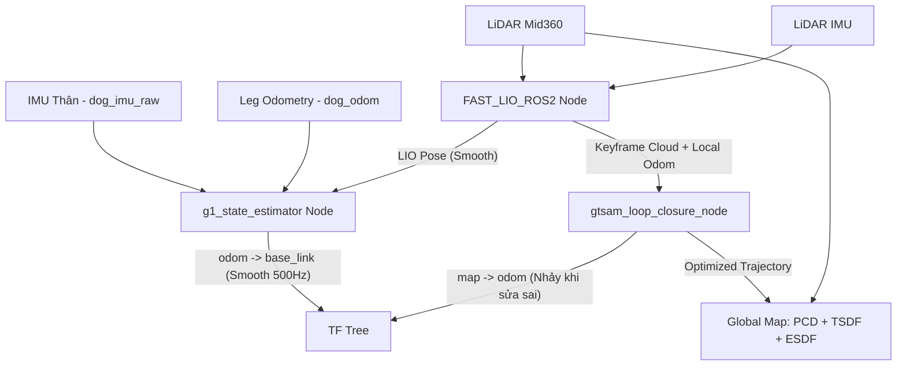

# Phân tích Kiến trúc SLAM & State Estimation trên Unitree G1

Tài liệu này trình bày chi tiết kiến trúc hệ thống bản đồ toàn cục nhất quán (Globally Consistent Mapping - PCD/TSDF/ESDF) và bộ ước lượng trạng thái động học (State Estimation) đã được triển khai hoàn chỉnh cho robot Unitree G1. Hệ thống sử dụng mô hình thiết kế rời rạc (Decoupled Loop Closure Backend) kết hợp với EKF cục bộ tần số cao nhằm tối ưu hóa tài nguyên tính toán và đảm bảo an toàn tối đa cho robot.

---

## 1. Đặt vấn đề & Mục tiêu thiết kế

Trong hệ thống hiện tại của bạn:

* **FAST-LIO2** đóng vai trò là LIO (LiDAR-Inertial Odometry) cục bộ. Nó không có cơ chế phát hiện vòng lặp (Loop Closure) hay tối ưu hóa toàn cục, dẫn đến sai số trôi (drift) tăng dần theo thời gian/quãng đường. Bản đồ đám mây điểm (PCD) tích lũy sẽ bị nhòe hoặc lệch khi robot quay lại điểm cũ.
* **g1_state_estimator** chạy EKF ở tần số cao (500Hz) để fuse IMU, LIO Pose và Leg Odometry (`dog_odom`), cung cấp transform `odom` $\rightarrow$ `base_link` phục vụ trực tiếp cho bộ điều khiển thăng bằng/di chuyển (locomotion) của robot.

**Mục tiêu:** Bổ sung cơ chế **Loop Closure (Vòng lặp đóng)** và **Pose Graph Optimization (Tối ưu hóa đồ thị tư thế)** để hiệu chỉnh bản đồ toàn cục mà không gây ảnh hưởng đến sự ổn định của bộ điều khiển locomotion tần số cao.

---

## 2. Hướng đi đã chọn: Thiết kế Module hóa rời rạc (Decoupled Loop Closure)

Hệ thống lựa chọn phương án giữ nguyên bộ ước lượng cục bộ hiện tại (`FAST_LIO_ROS2` + `g1_state_estimator`), chỉ bổ sung một node Backend độc lập (`gtsam_loop_closure_node`) để chạy tối ưu hóa toàn cục tần số thấp.

### 2.1. Sơ đồ khối & Luồng dữ liệu



### 2.2. Cách thức hoạt động

1. **Front-end & State Estimator (Cục bộ)**:
   * `FAST_LIO_ROS2` cung cấp LIO Pose mượt mà.
   * `g1_state_estimator` fuse IMU, Leg Odom và LIO Pose để sinh ra transform liên tục `odom` $\rightarrow$ `base_link` ở tần số 500Hz.
2. **Backend Node độc lập (`gtsam_loop_closure_node`)**:
   * Đăng ký nhận thông tin Keyframe Point Cloud và LIO Odometry từ Front-end.
   * Chạy luồng phát hiện loop closure độc lập (tần số thấp ~1Hz) bằng ICP/GICP và Scan Context.
   * Thực hiện tối ưu hóa đồ thị tư thế (GTSAM) khi phát hiện vòng lặp thành công.
   * Publish transform `map` $\rightarrow$ `odom`. Bản đồ PCD toàn cục chỉ được cập nhật các tọa độ đã tối ưu tại node này.

---

## 3. Bảng so sánh chi tiết hai hướng đi

| Tiêu chí so sánh                           | Hướng 1: Hệ thống gộp (FAST_LIO_SAM)                                                                                                                                                                                                                                 | Hướng 2: Module hóa rời rạc (Decoupled - Được chọn)                                                                                                                                                                                |
| :-------------------------------------------- | :------------------------------------------------------------------------------------------------------------------------------------------------------------------------------------------------------------------------------------------------------------------------ | :------------------------------------------------------------------------------------------------------------------------------------------------------------------------------------------------------------------------------------------ |
| **An toàn cho Locomotion**             | ⚠️**Rủi ro cao**: Do hệ thống tích hợp sâu, nếu LIO pose bị trễ hoặc có bước nhảy đột ngột (Pose Jump) khi Loop Closure kích hoạt, bộ EKF cục bộ có thể bị sốc dữ liệu, truyền lệnh điều khiển sai lệch làm robot G1 bị ngã. | **Cực kỳ an toàn**: Tách biệt hoàn toàn `odom -> base_link` (EKF cục bộ luôn mượt mà) và `map -> odom` (chứa các bước nhảy sửa sai số). Robot di chuyển không bao giờ bị ảnh hưởng bởi Loop Closure. |
| **Độ chính xác bản đồ**          | **Rất cao**: Đồ thị GTSAM tối ưu hóa trực tiếp dựa trên các ràng buộc LIO Front-end.                                                                                                                                                                  | **Rất cao**: Sử dụng chung bản chất toán học (GTSAM + ICP) giống Hướng 1 nên độ chính xác bản đồ toàn cục là tương đương.                                                                                   |
| **Độ ổn định khi mất dấu LiDAR** | ❌**Kém hơn**: Không tích hợp động học chân (Leg Kinematics). Nếu LiDAR đi vào góc tối/tường kính và mất dấu, hệ thống dễ bị phân kỳ.                                                                                                     | **Vượt trội**: EKF cục bộ liên tục fuse thông tin vận tốc chân từ `/dog_odom` giúp duy trì trạng thái robot ổn định khi LiDAR tạm thời bị che khuất hoặc mất dấu.                                         |
| **Độ phức tạp triển khai**         | ⚠️**Cao**: Phải tìm kiếm, sửa lỗi biên dịch (ROS 1 sang ROS 2) và cấu hình lại từ đầu một package tích hợp lớn, căn chỉnh lại từ đầu các tham số IMU/LiDAR.                                                                             | **Thấp/Vừa phải**: Tận dụng 100% mã nguồn và các tham số đã hoạt động ổn định của `FAST_LIO_ROS2` và `g1_state_estimator`. Chỉ cần bổ sung thêm 1 node backend.                                           |
| **Khả năng cứu hộ (Fail-safe)**     | ❌**Kém**: Nếu node SLAM tổng hợp gặp sự cố hoặc bị treo CPU, toàn bộ hệ thống định vị của robot sẽ dừng lại.                                                                                                                                   | **Tốt**: Nếu node Backend/Loop Closure bị crash hoặc lag, robot G1 vẫn đứng vững và đi lại an toàn nhờ EKF cục bộ không bị ảnh hưởng.                                                                             |

---

## 4. Cấu trúc và Tổ chức Mã nguồn Hệ thống Hiện tại

Hệ thống State Estimation và SLAM Backend hiện tại của Unitree G1 được tích hợp hoàn toàn trong package `g1_state_estimator` theo mô hình thiết kế rời rạc (Decoupled Architecture).

### 4.1. Sơ đồ cây thư mục của package `g1_state_estimator`

```text
dev_unitreeg1_ws/src/g1_state_estimator/
├── CMakeLists.txt                       # File cấu hình build (đăng ký EKF, GTSAM Loop Closure, SaveMap Service và scripts)
├── package.xml                          # Khai báo phụ thuộc (GTSAM, PCL, tf2, rclcpp...)
├── srv/
│   └── SaveMap.srv                      # ROS 2 Service definition để lưu bản đồ PCD và trajectory
├── include/g1_state_estimator/
│   ├── estimator.h                      # Lớp tính toán lọc EKF (IMU + Leg Odom + LIO)
│   ├── estimator_node.h                 # ROS 2 Wrapper cho EKF Node
│   ├── state.h                          # Khai báo cấu trúc biến trạng thái của EKF
│   └── gtsam_loop_closure_node.h        # Node GTSAM Backend tối ưu hóa Pose Graph ngầm
├── src/
│   ├── estimator.cpp                    # Triển khai thuật toán EKF
│   ├── estimator_node.cpp               # Triển khai ROS 2 Node EKF (500Hz)
│   ├── main.cpp                         # Điểm chạy chính của EKF Node
│   ├── gtsam_loop_closure_node.cpp      # Triển khai tối ưu hóa GTSAM, đồng bộ Keyframe, phát hiện Loop (ICP/GICP)
│   ├── gtsam_loop_closure_main.cpp      # Điểm chạy chính của Loop Closure Node
│   └── timestamp_corrector_node.cpp     # Hiệu chỉnh timestamp cho dữ liệu LiDAR/IMU
├── config/
│   ├── estimator.yaml                   # Cấu hình các tham số cảm biến, hiệp sai EKF cục bộ
│   ├── gtsam_loop_closure.yaml          # Tham số chọn Keyframe, khoảng cách tìm Loop, cấu hình nhiễu GTSAM
│   ├── voxblox_global.yaml              # Cấu hình TSDF Global Mapping (map frame)
│   └── voxblox_local.yaml               # Cấu hình ESDF Local Mapping tránh vật cản (odom frame)
├── launch/
│   ├── estimator.launch.py              # Launch đồng thời EKF Node và GTSAM Loop Closure Node
│   └── voxblox.launch.py                # Launch cấu hình Voxblox Global và Local
├── scripts/
│   └── save_all_maps.py                 # Công cụ CLI (Python) lưu tất cả định dạng bản đồ đồng thời
└── docs/
    ├── slam_architecture_analysis.md    # Tài liệu kiến trúc này
    └── localization_implementation_plan.md # Hướng dẫn triển khai NDT Localization Node
```

---

## 5. Chi tiết mã nguồn C++ của GTSAM Loop Closure Node

Dưới đây là mô tả chi tiết giao diện lớp và luồng xử lý toán học đã được cài đặt trong `gtsam_loop_closure_node`:

### 5.1. File Header: `gtsam_loop_closure_node.h`

```cpp
#pragma once

#include <rclcpp/rclcpp.hpp>
#include <nav_msgs/msg/odometry.hpp>
#include <sensor_msgs/msg/point_cloud2.hpp>
#include <tf2_ros/transform_broadcaster.h>
#include <tf2_ros/buffer.h>
#include <tf2_ros/transform_listener.h>

// PCL (Point Cloud Library)
#include <pcl/point_cloud.h>
#include <pcl/point_types.h>
#include <pcl_conversions/pcl_conversions.h>
#include <pcl/filters/voxel_grid.h>
#include <pcl/registration/gicp.h>

// GTSAM
#include <gtsam/geometry/Pose3.h>
#include <gtsam/nonlinear/NonlinearFactorGraph.h>
#include <gtsam/nonlinear/Values.h>
#include <gtsam/nonlinear/ISAM2.h>

#include <mutex>
#include <thread>
#include <vector>
#include <deque>

class GtsamLoopClosureNode : public rclcpp::Node {
public:
    using PointT = pcl::PointXYZI;
  
    GtsamLoopClosureNode();
    ~GtsamLoopClosureNode();

private:
    // ROS 2 Subscriptions & Publishers
    rclcpp::Subscription<nav_msgs::msg::Odometry>::SharedPtr odom_sub_;
    rclcpp::Subscription<sensor_msgs::msg::PointCloud2>::SharedPtr cloud_sub_;
    rclcpp::Publisher<sensor_msgs::msg::PointCloud2>::SharedPtr global_map_pub_;
    std::unique_ptr<tf2_ros::TransformBroadcaster> tf_broadcaster_;

    // ROS Parameters
    std::string map_frame_;
    std::string odom_frame_;
    std::string base_frame_;
    double kf_dist_threshold_;   // Khoảng cách tối thiểu tạo keyframe (m)
    double kf_angle_threshold_;  // Góc xoay tối thiểu tạo keyframe (rad)
    double loop_search_radius_;  // Bán kính tìm kiếm vòng lặp (m)
    double icp_fitness_score_;   // Ngưỡng tin cậy của GICP

    // Buffers nhận dữ liệu từ ROS
    std::deque<nav_msgs::msg::Odometry> odom_buf_;
    std::deque<sensor_msgs::msg::PointCloud2> cloud_buf_;
    std::mutex buf_mutex_;

    // Cấu trúc dữ liệu Keyframe
    struct Keyframe {
        int id;
        double timestamp;
        gtsam::Pose3 pose_odom;      // Tư thế thô nhận từ EKF odom
        gtsam::Pose3 pose_optimized; // Tư thế sau khi GTSAM tối ưu
        pcl::PointCloud<PointT>::Ptr cloud; // Cloud đã downsample
    };
    std::vector<Keyframe> keyframes_;
    std::mutex kf_mutex_;

    // GTSAM
    gtsam::NonlinearFactorGraph gt_graph_;
    gtsam::Values gt_initial_values_;
    gtsam::Values gt_optimized_values_;
    std::unique_ptr<gtsam::ISAM2> isam_;
  
    gtsam::noiseModel::Diagonal::shared_ptr odom_noise_;
    gtsam::noiseModel::Diagonal::shared_ptr loop_noise_;

    // Transform Hiệu chỉnh
    Eigen::Affine3d T_map_odom_;
    std::mutex tf_mutex_;

    // Threads
    std::thread loop_thread_;
    std::thread map_pub_thread_;
    bool run_threads_ = true;

    // Các hàm xử lý Callback
    void OdomCallback(const nav_msgs::msg::Odometry::SharedPtr msg);
    void CloudCallback(const sensor_msgs::msg::PointCloud2::SharedPtr msg);

    // Xử lý đồ thị & Keyframe
    bool CheckAndCreateKeyframe(const nav_msgs::msg::Odometry& odom, const sensor_msgs::msg::PointCloud2& cloud);
    void AddKeyframeToGraph(const Keyframe& kf);

    // Luồng ngầm
    void LoopClosureThread();
    void MapPublishThread();

    // Thuật toán phụ trợ
    std::vector<int> SearchLoopCandidates(const gtsam::Pose3& curr_pose);
    bool AlignCloudsGICP(const pcl::PointCloud<PointT>::Ptr& source, 
                         const pcl::PointCloud<PointT>::Ptr& target,
                         const gtsam::Pose3& guess,
                         gtsam::Pose3& result_transform);
    void UpdateMapOdomTransform();
    void PublishTF();
};
```

---

## 6. Cấu hình tham số chi tiết (`gtsam_loop_closure.yaml`)

File cấu hình này quy định hành vi của ISAM2, ngưỡng tạo keyframe và ma trận trọng số sai lệch cảm biến cho Pose Graph Optimization:

```yaml
gtsam_loop_closure_node:
  ros__parameters:
    # ----------------------------------------------------
    # Tọa độ & Frame
    # ----------------------------------------------------
    map_frame: "map"
    odom_frame: "odom"
    base_frame: "base_link"

    # ----------------------------------------------------
    # Điều kiện tạo Keyframe (Keyframe Selection)
    # ----------------------------------------------------
    keyframe_distance: 1.0     # Khoảng cách tối thiểu giữa 2 keyframe (meters)
    keyframe_angle: 0.2        # Góc xoay tối thiểu giữa 2 keyframe (radians, ~11.5 degrees)

    # ----------------------------------------------------
    # Tìm kiếm Vòng lặp (Loop Closure Search)
    # ----------------------------------------------------
    loop_closure_enable: true
    loop_search_radius: 5.0     # Bán kính tìm kiếm các keyframe cũ trong vùng lân cận (meters)
    loop_search_time_diff: 30.0 # Khoảng thời gian tối thiểu cách biệt với quá khứ để coi là vòng lặp (seconds)
    loop_frequency: 1.0         # Tần số chạy luồng tìm kiếm vòng lặp (Hz)
    min_history_keyframes: 30   # Số lượng keyframe tối thiểu bỏ qua từ thời điểm hiện tại để tránh khớp chính nó

    # ----------------------------------------------------
    # So khớp mây điểm (GICP / ICP Registration)
    # ----------------------------------------------------
    icp_fitness_score: 0.2      # Ngưỡng lỗi hội tụ tối đa của GICP (càng nhỏ càng khắt khe, mặc định 0.2)
    gicp_max_distance: 1.0      # Khoảng cách tương ứng tối đa giữa các điểm để so khớp (meters)
    gicp_max_iterations: 50     # Số lần lặp tối đa của thuật toán GICP
    voxel_grid_leaf_size: 0.4   # Kích thước ô voxel lọc mây điểm keyframe (meters)

    # ----------------------------------------------------
    # Hiệp sai nhiễu đồ thị (GTSAM Covariance / Sigmas)
    # ----------------------------------------------------
    # Định dạng: [roll, pitch, yaw, x, y, z] nhiễu đo
    odom_noise_sigmas: [0.001, 0.001, 0.001, 0.01, 0.01, 0.01]  # Nhiễu tích lũy odometry
    loop_noise_sigmas: [0.0001, 0.0001, 0.0001, 0.001, 0.001, 0.001] # Nhiễu ràng buộc vòng khép (tin cậy cao hơn)

    # ----------------------------------------------------
    # Hiển thị và Xuất bản (Visualization)
    # ----------------------------------------------------
    map_publish_frequency: 0.1  # Tần số xuất bản bản đồ PCD toàn cục (Hz, ví dụ 0.1Hz = 10s một lần)
```

### Giải thích các tham số quan trọng:

1. **`keyframe_distance` & `keyframe_angle`**: Kiểm soát mật độ các nút trong đồ thị GTSAM. Giá trị $1.0\text{ m}$ hoặc $0.2\text{ rad}$ là khoảng cách cân bằng lý tưởng để tránh CPU bị quá tải trong môi trường chuyển động chậm của robot G1.
2. **`loop_search_radius`**: Bán kính tìm kiếm các keyframe cũ. Nếu drift quá lớn trước khi quay về, hãy tăng lên `10.0m` hoặc `12.0m`.
3. **`icp_fitness_score`**: Ngưỡng bộ lọc để chấp nhận một loop factor. Lỗi trung bình khoảng cách giữa các điểm khớp sau GICP phải nhỏ hơn giá trị này.
4. **`odom_noise_sigmas` & `loop_noise_sigmas`**: `loop_noise_sigmas` được đặt nhỏ hơn `odom_noise_sigmas` từ 5 đến 10 lần để báo cho GTSAM ưu tiên biến đổi nắn chỉnh theo dữ liệu vòng khép hơn là tích lũy odometry bị trôi.

---

## 7. Quản lý và Lưu trữ Dữ liệu Bản đồ (Map Data Management)

Dữ liệu bản đồ trong kiến trúc rời rạc (Decoupled) được phân tách thành 3 dạng chính:

### 7.1. Đường đi tối ưu (Optimized Trajectory)

* **Kiểu dữ liệu**: `nav_msgs/msg/Path` xuất bản lên topic `/state_estimator/optimized_path`.
* **Mục đích**: Hiển thị quỹ đạo di chuyển thực tế (đã sửa trôi) dưới dạng một đường vẽ liên tục trên RViz.

### 7.2. Bản đồ đám mây điểm toàn cục (Global PCD Map)

* **Kiểu dữ liệu**: `sensor_msgs/msg/PointCloud2` xuất bản lên topic `/state_estimator/global_map`.
* **Cơ chế lưu trữ xuống đĩa cứng (PCD Saving Service)**:
  Hệ thống thiết lập một ROS 2 Service trong Node Backend `/state_estimator/save_map` (kiểu service tự định nghĩa `g1_state_estimator/srv/SaveMap` cho phép truyền tham số tùy chọn là đường dẫn thư mục và tiền tố tên file):

  ```bash
  ros2 service call /state_estimator/save_map g1_state_estimator/srv/SaveMap "{destination_path: '/home/hoangdc/ROS2/unitree_G1/maps/', file_prefix: 'g1_office'}"
  ```

  Service này sẽ thực hiện dựng lại bản đồ đám mây điểm từ các tư thế đã tối ưu, lưu thành file `.pcd` và lưu quỹ đạo di chuyển định dạng TUM (.txt).

---

## 8. Volumetric Collision Mapping với Voxblox (TSDF/ESDF)

Bản đồ thể tích **TSDF** (để biểu diễn bề mặt vật thể) và **ESDF** (để tính toán khoảng cách 3D từ bất kỳ điểm nào trong không gian đến vật cản gần nhất) được khởi chạy song song 2 node với 2 vai trò riêng biệt:

1. **Node toàn cục (`voxblox_global`)**:

   * **Vai trò**: Dựng lưới mesh 3D toàn cục (TSDF) của môi trường phục vụ cho việc quan sát và lưu trữ bản đồ.
   * **Hệ tọa độ đích (`world_frame`)**: `map`.
   * **Cách hoạt động**: Nhận mây điểm `/utlidar/cloud_livox_mid360_sync` và chiếu lên hệ `map`. Khi Backend Loop Closure cập nhật và thay đổi transform `map` $\rightarrow$ `odom`, lưới mesh 3D toàn cục sẽ tự động nắn chỉnh theo hệ tọa độ tối ưu mới.
2. **Node cục bộ (`voxblox_local`)**:

   * **Vai trò**: Tính toán lưới khoảng cách vật cản (ESDF) thời gian thực phục vụ cho bộ lập kế hoạch tránh vật cản (Local Planner/Avoidance).
   * **Hệ tọa độ đích (`world_frame`)**: `odom`.
   * **Cách hoạt động**: Chiếu mây điểm lên hệ `odom` qua TF. Vì frame `odom` là liên tục và không bao giờ bị nhảy tọa độ đột ngột khi có loop closure, lưới ESDF cục bộ quanh robot sẽ cực kỳ mượt mà, giúp tránh hiện tượng "bóng ma" (Ghosting) vật cản ảo.

```mermaid
graph TD
    LiDAR_Sync[/utlidar/cloud_livox_mid360_sync] -->|Sensor Frame: livox_frame| Voxblox_Local[Voxblox Local Node: esdf_server]
    LiDAR_Sync -->|Sensor Frame: livox_frame| Voxblox_Global[Voxblox Global Node: tsdf_server]

    TF_Odom[TF: odom -> base_link -> livox_frame] --> Voxblox_Local
    TF_Map[TF: map -> odom -> base_link -> livox_frame] --> Voxblox_Global

    Voxblox_Local -->|Local Obstacles| Local_ESDF[/voxblox_local/esdf_pointcloud & /voxblox_local/esdf_slice]
    Voxblox_Global -->|Global Map Mesh| Global_TSDF_Mesh[/voxblox_global/mesh]
```

### 8.1. File cấu hình Voxblox

#### 1. Cấu hình bản đồ toàn cục (`voxblox_global.yaml`)

```yaml
/**:
  ros__parameters:
    tsdf_voxel_size: 0.10        # Kích thước mỗi ô voxel (10cm là tối ưu cho G1)
    tsdf_voxels_per_side: 16     # Số ô voxel trên mỗi cạnh của một Block
    world_frame: "map"           # Hệ tọa độ đích toàn cục (có loop closure)
    sensor_frame: "livox_frame"  # Trùng khớp với frame_id của cảm biến LiDAR Mid360
    max_ray_length_m: 8.0        # Tầm hoạt động tối đa chiếu tia laser
    min_ray_length_m: 0.2        # Tầm hoạt động tối thiểu để loại bỏ nhiễu gần robot
    allow_clear: true            # Xóa các vùng trống dọc theo tia chiếu laser
    use_const_weight: false      # Trọng số suy giảm theo khoảng cách
    generate_esdf: false         # Tắt tạo ESDF để tiết kiệm tài nguyên CPU
    update_mesh_every_n_sec: 1.0  # Tần số cập nhật lưới hiển thị 3D (1.0s một lần)
    publish_tsdf_map: false      # Không publish mây điểm TSDF thô
    publish_slices: false        # Không tạo các lát cắt 2D toàn cục
    mesh_filename: ""            # Đường dẫn lưu mesh 3D (sẽ được cập nhật động qua saver script)

    # ----------------------------------------------------
    # Tham số cấu hình nâng cao
    # ----------------------------------------------------
    truncation_distance: 0.4             # Khoảng cắt TSDF (m) (tsdf_voxel_size * 4)
    max_weight: 10000.0                  # Trọng số tích lũy tối đa cho mỗi voxel
    use_weight_dropoff: true             # Giảm trọng số của các điểm phía sau bề mặt vật cản
    voxel_carving_enabled: true          # Xóa các ô trống dọc theo tia laser chiếu từ cảm biến
    anti_grazing: false                  # Chống quét sượt làm bo tròn góc nhọn vật cản
    mesh_min_weight: 0.0001              # Trọng số tối thiểu để dựng lưới mesh 3D
    mesh_use_color: true                 # Sử dụng màu sắc từ Point Cloud để tô màu mesh 3D
```

#### 2. Cấu hình tránh vật cản cục bộ (`voxblox_local.yaml`)

```yaml
/**:
  ros__parameters:
    tsdf_voxel_size: 0.10
    tsdf_voxels_per_side: 16
    world_frame: "odom"          # Hệ tọa độ cục bộ liên tục (không giật khi loop)
    sensor_frame: "livox_frame"
    max_ray_length_m: 5.0        # Giới hạn tia laser ngắn hơn (5.0m) để giảm tải tính toán
    min_ray_length_m: 0.2
    allow_clear: true
    use_const_weight: false
    generate_esdf: true          # Bắt buộc bật để tính toán khoảng cách vật cản
    publish_esdf_map: true       # Xuất bản bản đồ ESDF dạng PointCloud để sử dụng
    esdf_max_distance_m: 2.0     # Khoảng cách xa nhất cần tính ESDF (2.0m là đủ tránh vật cản)
    update_mesh_every_n_sec: 0.2  # Tần số cập nhật mesh cực nhanh (5Hz) để phản ứng kịp thời
    update_esdf_every_n_sec: 0.2  # Tần số tính toán ESDF (5Hz) giúp tránh vật cản thời gian thực
    publish_tsdf_map: false
    publish_slices: true         # Bật lát cắt 2D
    slice_level: 0.0             # Lát cắt ngang độ cao 0.0m so với base_link (ngang tầm chân/đùi robot)
    max_block_distance_from_body: 5.0 # Bán kính giới hạn bản đồ cục bộ quanh robot (tự động xóa các block cũ xa hơn 5m)

    # ----------------------------------------------------
    # Tham số cấu hình nâng cao
    # ----------------------------------------------------
    truncation_distance: 0.4             # Khoảng cắt TSDF (m) (tsdf_voxel_size * 4)
    max_weight: 10000.0                  # Trọng số tích lũy tối đa cho mỗi voxel
    use_weight_dropoff: true             # Giảm trọng số của các điểm phía sau bề mặt vật cản
    voxel_carving_enabled: true          # Xóa các ô trống dọc theo tia laser chiếu từ cảm biến
    anti_grazing: false                  # Chống quét sượt làm bo tròn góc nhọn vật cản
    clear_sphere_radius: 1.5             # Bán kính vùng ép buộc là trống (free) quanh robot (m)
    occupied_sphere_radius: 5.0          # Bán kính ngoài cùng ép buộc là vật cản (occupied) (m)
    esdf_add_occupied_crust: false       # Tạo vỏ chướng ngại vật ở ranh giới ngoài cùng của bản đồ local
    esdf_euclidean_distance: true        # Tính khoảng cách Euclid đầy đủ thay vì Quasi-Euclidean
```

---

## 9. Vận hành hệ thống

### 9.1. Quy trình Biên dịch (Build)

Chuyển đến thư mục gốc của workspace để tiến hành biên dịch:

```bash
cd ~/ROS2/unitree_G1/dev_unitreeg1_ws
colcon build --packages-select g1_state_estimator --symlink-install
source install/setup.bash
```

### 9.2. Chạy EKF và Loop Closure Backend

Chạy một câu lệnh launch duy nhất để khởi chạy bộ ước lượng cục bộ EKF và GTSAM Loop Closure:

```bash
ros2 launch g1_state_estimator estimator.launch.py
```

### 9.3. Chạy Bản đồ mạng lưới thể tích Voxblox

Chạy câu lệnh sau trong một terminal mới để khởi chạy Voxblox:

```bash
ros2 launch g1_state_estimator voxblox.launch.py
```

---

## 10. Công cụ Lưu tất cả các loại Bản đồ đồng thời (Unified Map Saver)

Để tránh việc phải gọi riêng lẻ từng service để lưu bản đồ (LIO và Voxblox) và sinh bản đồ 2D thủ công, một công cụ hợp nhất đã được viết bằng Python nằm tại `src/g1_state_estimator/scripts/save_all_maps.py`.

Khi chạy, công cụ này sẽ thực hiện đồng thời các tác vụ sau:

1. **Lưu bản đồ 3D**: Gọi service `/state_estimator/save_map` để lưu bản đồ đám mây điểm toàn cục (`.pcd`) và quỹ đạo di chuyển (`_trajectory.txt`).
2. **Cập nhật Mesh 3D**: Thay đổi động tham số `mesh_filename` của node `/voxblox_global` sang thư mục con mong muốn và gọi service `/voxblox_global/generate_mesh` để lưu file lưới 3D dạng `.ply`.
3. **Lưu bản đồ TSDF**: Gọi service `/voxblox_global/save_map` để lưu trạng thái nhị phân đầy đủ của lưới TSDF dưới dạng `.voxblox`.
4. **Tự động Cân bằng & Tạo Gridmap 2D**: Sau khi lưu PCD thành công, công cụ sẽ tự động kích hoạt script `pcd_to_gridmap.py` để:
   * Tìm mặt phẳng sàn bằng thuật toán RANSAC.
   * Xoay thẳng mây điểm (cân bằng trọng lực) nếu mặt sàn bị nghiêng dốc (do trôi IMU) và đưa sàn về cao độ chuẩn $-0.75\text{m}$.
   * Lưu file mây điểm 3D đã cân bằng sạch sẽ thành file `*_aligned.pcd` (phục vụ NDT Localization).
   * Chiếu lát cắt mây điểm theo cao độ cấu hình để xuất ra bộ bản đồ 2D Gridmap `.pgm` và `.yaml` (phục vụ Nav2 điều hướng).

### Cấu hình tham số (`config/map_saver.yaml`):

Các cài đặt mặc định được quản lý thông qua file cấu hình `src/g1_state_estimator/config/map_saver.yaml`:
```yaml
map_saver:
  save_dir: "/home/hoangdc/ROS2/unitree_G1/maps/"
  prefix: "g1_office"
  pcd_to_gridmap_script: "/home/hoangdc/ROS2/unitree_G1/dev_unitreeg1_ws/src/g1_navigation_nav2/scripts/pcd_to_gridmap.py"
  
  gridmap:
    min_z: -0.60         # Ngưỡng lọc dưới (so với sàn đã căn chỉnh ở Z = -0.75m)
    max_z: 0.45          # Ngưỡng lọc trên (so với sàn đã căn chỉnh ở Z = -0.75m)
    resolution: 0.05     # Độ phân giải bản đồ 2D (m/cell)
    align_gravity: true  # Bật tự động xoay cân bằng trọng lực mặt sàn
```

### Hướng dẫn sử dụng:

Chạy lệnh sau trong terminal:

```bash
ros2 run g1_state_estimator save_all_maps.py --dir /home/hoangdc/ROS2/unitree_G1/maps --prefix g1_office
```

* `--dir` hoặc `-d`: Thư mục gốc lưu bản đồ (Mặc định lấy từ file config YAML).
* `--prefix` hoặc `-p`: Tên bản đồ (Mặc định lấy từ file config YAML).

**Tổ chức thư mục đầu ra:**
Công cụ sẽ tự động tạo một thư mục con mang tên bản đồ (`prefix`) để lưu trữ tất cả các file bên trong:

```text
/home/hoangdc/ROS2/unitree_G1/maps/g1_office/      <-- Thư mục con tự động tạo
├── g1_office.pcd            # Bản đồ Point Cloud 3D gốc
├── g1_office_aligned.pcd    # Bản đồ 3D đã xoay thẳng trọng lực (Dùng cho NDT)
├── g1_office_trajectory.txt # Quỹ đạo di chuyển robot (định dạng TUM)
├── g1_office.ply            # Mô hình lưới 3D Mesh hiển thị
├── g1_office.voxblox        # Bản đồ nhị phân TSDF của Voxblox
├── g1_office.pgm            # Bản đồ 2D Gridmap (Dùng cho Nav2)
└── g1_office.yaml           # Cấu hình bản đồ 2D Gridmap
```

---

## 11. Kinh nghiệm Căn chỉnh & Xử lý Sự cố Thực tế (Tuning & Troubleshooting)

### 11.1. Khắc phục lỗi CPU quá tải (CPU Overload)

* **Hiện tượng**: Robot bị giật lag, bản đồ cập nhật chậm, hoặc log cảnh báo chậm luồng (thread lag).
* **Giải pháp**:
  1. Tăng kích thước bộ lọc voxel (`voxel_grid_leaf_size`) từ `0.4` lên `0.5` hoặc `0.6`.
  2. Giảm tần số kiểm tra vòng lặp (`loop_frequency`) xuống `0.5 Hz` (2 giây một lần) thay vì `1.0 Hz`.
  3. Giảm số lần lặp tối đa của GICP (`gicp_max_iterations`) từ `50` xuống `30`.

### 11.2. Loop Closure không kích hoạt (Không nhận diện được vòng lặp)

* **Hiện tượng**: Robot đã đi vòng về vị trí cũ nhưng bản đồ vẫn bị chồng chéo (ghosting), không tự nắn thẳng lại.
* **Giải pháp**:
  1. Tăng `loop_search_radius` lên `10.0m` hoặc `12.0m` để bù đắp sai lệch trôi lớn.
  2. Nới lỏng ngưỡng lỗi hội tụ `icp_fitness_score` từ `0.2` lên `0.3`. (Không đặt quá `0.4`).

### 11.3. Bản đồ bị méo/biến dạng sau khi đóng vòng lặp (Map Distortion)

* **Hiện tượng**: Khi loop closure được thiết lập, bản đồ bị xoay hoặc kéo lệch hẳn sang một bên trông rất phi vật lý.
* **Giải pháp**:
  1. Tăng giá trị trong `loop_noise_sigmas` (làm giảm độ tin cậy của Loop) hoặc giảm `odom_noise_sigmas`.
  2. Loại bỏ các điểm laser thuộc về chính thân robot (self-filter) để GICP không bị khớp nhầm các điểm tĩnh trên cơ thể robot.
